## 1. 环境要求

使用 Android 4.1 （SDK API Level 16）及以上版本。

## 2. 云游戏接入了解和准备

### 接入前准备

  在接入云游戏前，需要完成接入前的[准备](https://cloud.tencent.com/document/product/1162/46135 )工作。根据准备文档中的步骤1-4完成接入云游前的前置要求。

### 云游交互流程

  在完成上面的准备工作后，您还需要搭建自己的[业务后台](AndroidSDK快速入门.md#step3)和[业务客户端](AndroidSDK快速入门.md#step4)来接入云游戏服务。业务后台和业务客户端所扮演的角色介绍:

- 云游SDK集成云游功能，初始化后可创建会话和渲染视图，获取拿到云端的serverSession启动云游戏。
- 业务客户端需要集成云游SDK，在SDK初始化成功回调之后完成对TcrSession和渲染视图的创建。通过TcrSession初始化后得到ClientSession并请求后台获取ServerSession
- 业务后台作为客户端和云游戏后台的中介，与客户端完成会话的传递。业务后台请求云 API 锁定机器并创建会话，拿到 serverSession并返回给客户端。
- 下图为云游戏启动流程



[](id:step3)

## 3. 搭建业务后台

您可以通过[这篇文档](https://cloud.tencent.com/document/product/1162/65429#upload)完成对业务后台的搭建。

[](id:step4)

## 4. 搭建业务客户端程序

完成和了解上述步骤后，您会得到客户端访问业务后台的所需的GAME_ID和Server地址。客户端APP启动流程如下图所示。


### 操作步骤

首先创建一个空的android工程。

1. 在应用模块中的'build.gradle'中加入:

```java
implementation 'com.tencent.tcr:tcrsdk-full:2.0.0'
// implementation 'com.tencent.tcr:tcrsdk-lite:2.0.0'  // 轻量版SDK集成，请参考第五点介绍
```

2. AndroidManifest 配置网络权限：

```java
<uses-permission android:name="android.permission.ACCESS_NETWORK_STATE" />
<uses-permission android:name="android.permission.INTERNET" />
// <uses-permission android:name="android.permission.WRITE_EXTERNAL_STORAGE" /> 轻量版SDK需要从网络下载插件到SD卡，需要配置该权限。默认完整版无需读写权限。
// <uses-permission android:name="android.permission.READ_EXTERNAL_STORAGE" />
```

3. 设置GAME_ID和业务后台Server地址

```java
// server/CloudGameApi
public static final String GAME_ID = "game-xxxxxx";

// server/CloudGameApi#startGame
final String START_GAME_URL = "https://xxxx.myqcloud.com/StartGame";

```

4. 初始化SDK，创建clientSession和渲染视图，并将渲染视图添加到layout上。

```java
// 初始化SDK GameActivity#onCreate()
TcrSdk.getInstance().init(this, null, mInitSdkCallback);

// 创建会话对象 GameActivity#mInitSdkCallback
mTcrSession = TcrSdk.getInstance().createTcrSession(createSessionConfig());
// 创建渲染视图
mRenderView = TcrSdk.getInstance().createTcrRenderView(PCGameActivity.this, mTcrSession,TcrRenderViewType.SURFACE);
// 给渲染视图设置触摸处理对象, PCTouchHandler会将视图上的触摸事件透传给云端
PcTouchHandler mPcTouchHandler = new PcTouchHandler();
mRenderView.setOnTouchListener(mPcTouchHandler);
// 将渲染视图添加到界面上
((FrameLayout) PCGameActivity.this.findViewById(R.id.main)).addView(mRenderView);
// 为会话设置渲染视图,
mTcrSession.setRenderView(mRenderView);
// 初始化会话
mTcrSession.init(mInitSessionCallback);
```

5. 初始化会话成功后得到clientSession， 请求后台启动游戏并获取ServerSession。客户端获取ServerSession后启动会话。

```java
mCloudGameApi.startGame(clientSession, response -> {
    Log.i(TAG, "start game success: " + response);
    // 用从服务端获取到的server session启动会话
    GameStartResponse result = new Gson().fromJson(response.toString(), GameStartResponse.class);
    if (result.code == 0) {
        mTcrSession.start(result.sessionDescribe.serverSession, mStartSessionCallback);
    }
}, error -> Log.i(TAG, "start game failed:" + error));
```

6. 端/手游操作模式设定,您需要根据云端游戏所属的类型对手机触摸事件的处理进行设置。

```java
// 手游操作模式设置
mRenderView.setOnTouchListener(new MobileTouchHandler());
```

```java
// 端游操作模式设置
PcTouchHandler pcTouchHandler = new PcTouchHandler();
pcTouchHandler.enableScaling(1,5);
mRenderView.setOnTouchListener(pcTouchHandler);
```

### demo下载

Demo下共有三个工程，分别是端游入门demo，手游入门demo以及轻量版SDK入门demo。其中端游和手游入门Demo的区别是对渲染视图设置的操作模式不同。而轻量版SDK则是在implementation轻量版SDK之后，需要在APP中初始化SDK前下载和加载插件。

您可以[下载Demo](https://github.com/tencentyun/cloudgame-android-sdk/blob/master/TcrCloudGame/Demo.zip)阅读完整的调用示例代码，根据上述步骤了解和快速接入您的云端游戏。Demo可以直接下载导入android studio运行，其中配置的Game_ID和server仅用于示例，您需要更换相应的参数替换为您的游戏。

## 5. 轻量版SDK

1. 轻量版SDK采用插件化设计，集成SDK的APP可以选择使用轻量版SDK(体积增量仅65KB)，运行时再从网络下载SDK插件(9MB)后进行动态加载。
../README.md2. 二者在使用上并无区别，区别在于轻量版SDK需要下载插件并动态加载后成为完整的SDK包。
3. 在使用选择方面：如果有对包体积大小有要求的APP，我们推荐集成轻量版SDK；如果对包体积大小没有限制，我们推荐使用完整版SDK，减少SDK加载的过程和提高集成速度。
