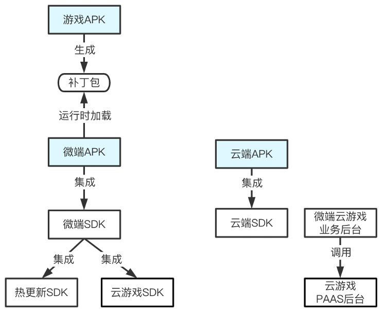
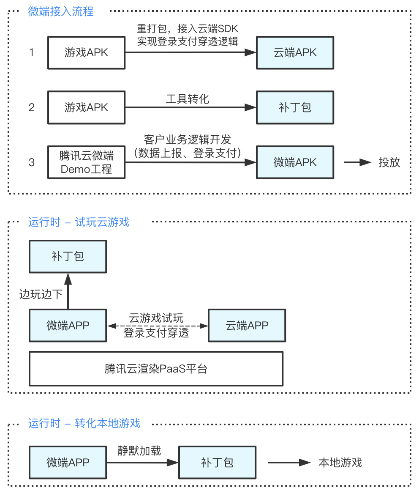

# 1. 整体流程概述

微端有两种接入方式：快速接入版和功能增强版。功能增强版是通过下载补丁包然后动态加载（热更新）的方式实现微端包到完整包的转化，并且还实现了登录/支付的穿透。

**功能增强版涉及的模块和关系如下。** 其中，您只需要实现游戏APK、微端APP、云端APP，其他模块由腾讯云提供。



|  模块   |  说明   |
|---    |---    |
|  游戏APK    |  游戏APK，可以是任意安装包，用于生成补丁包。是微端APP热更新升级后的目标APP。    |
|  微端APK    |  微端APK，集成了微端SDK，是用于广告投放的包体，供C端用户玩云游戏的载体。  |
|  云端APK    |  云端APK，集成了云端SDK，运行于云端，是C端用户在微端上玩的云游戏。     |
|  补丁包    |  补丁包，由游戏APK经过工具转化生成。微端APK在运行时从网络下载补丁包，动态加载后进行热更新，从而升级为完整本地游戏。     |
|  微端SDK    |  微端SDK，集成了云游戏SDK和热更新SDK，实现了微端的应用逻辑，包括云游戏试玩，云端数据通道交互，补丁包的检查、下载、校验、合成，下载智能限速等交互逻辑。    |
|  云游戏SDK   |  云游戏SDK，实现云游戏能力，是云游戏PAAS平台服务的终端能力封装。  |
|  热更新SDK   |  热更新SDK，实现热更新机制，包括补丁包处理合成、加载逻辑。实现微端APP转化为本地游戏。    |
|  云端SDK    |  云端SDK，提供云端与终端数据通道能力，用于实现APP的登录和支付穿透的功能。   |
|  微端云游戏后台  |  微端云游戏试玩的业务后台，调用云游戏PAAS平台服务，实现云试玩的业务层逻辑。  |

&nbsp;

**功能增强版的整体接入和运行流程如下。**



**功能增强版具有如下优势。**

* 一站式便捷接入。

    流程极简，提供完备的SDK/Demo/工具，一次接入多个游戏复用。

* 投放包体极小。

    10M左右，提升投放效果，降低买量成本。

* 原生游戏体验。

    依赖于腾讯云渲染技术，云游戏体验接近本地游戏。本地原生的登录支付体验。

* 边玩边下。

    试玩云游戏的过程中静默下载补丁包，智能限速，不影响云游体验。

* 免安装静默升级。

    下载完补丁包后，免安装静默转化为本地游戏，用户无感知。

# 2. 原理解析

## 2.1 登录/支付穿透

登录穿透的逻辑流程是:

（1）微端APP调用本地的登录SDK完成本地登录过程，将获取到的登录结果信息，通过数据通道发送给云端APP。

（2）云端APP收到微端发送的登录结果信息，完成云端APP的登录交互。

&nbsp;

支付穿透的逻辑流程是:

（1）云端APP将支付请求，通过数据通道发送给微端APP。

（2）微端APP调用本地的支付SDK完成支付，将支付结果信息再通过数据通道发送给云端APP。

（3）云端APP使用这个信息完成云端APP的支付交互。

# 3. 详细接入步骤

## 3.1 构建云端APK

第一步，集成云端SDK。打开游戏原始包工程，在app/build.gradle文件中添加云端SDK依赖。

```groovy
dependencies {
    implementation "com.tencent.tcr:micro-cloud-sdk:2.0.0"
}
```

云端sdk的具体使用方法请参考[云端SDK的API文档](https://tencentyun.github.io/cloudgame-android-sdk/microsdk/com/tencent/tcr/micro/cloudsdk/DataChannel.html)，同时云端包的适配可以参考[云端APP示例工程](../Demo/云端APP示例工程/TcrMicroCloud.zip).

第二步，建立数据通道，实现登录/支付穿透的具体逻辑。

1）建立数据通道，开始监听微端发送的数据。监听的代码如下：

```java
   DataChannel.Listener listener = new DataChannel.Listener() {
        public void onReceive(byte[] buffer, int len) {
            // 从监听的端口接收到数据
            String dataFromRemote = new String(buffer, 0, len);
        }

        public void onException(Exception e) {
            // 数据接收或发送过程中出现异常
        }
    };
  
    // 建立并打开数据通道，开始监听
    mDataChannel = new DataChannel(listener, 6666);
    mDataChannel.open();
```

收到的数据可以是微端处理登录/支付之后生成的token或者一些自定义数据，云端包通过数据通道收到微端包处理的数据之后可以继续之前游戏原始包的登录/支付逻辑。

2）在需要登录/支付时通过数据通道向微端发起登录/支付指令。

登录/支付的具体逻辑需要迁移到微端包中，云端包不需要再处理，只需要在发起登录/支付时向微端包发送登录/支付指令，具体的登录/支付操作由微端包来处理。发送数据的方法如下：

```java
    /**
     * 通过此方法向发送方回复数据
     * 必须在数据通道连接成功后使用
     *
     * @param data 要发送的数据
     */
    public void sendData(String data) {
        if (mDataChannel != null) {
            mDataChannel.send(data.getBytes(Charset.forName("UTF-8")));
        }
    }
```

注意：发送数据必须在数据通道连接成功之后，该方法必须在**非UI线程**中调用。

第三步，云端APK的本地调试。

云端包需要部署到腾讯云服务器上才可以接收到微端包发送的数据，部署游戏相对比较复杂。因此需要在部署之前在本地测试云端APK的数据通道的功能是否符合预期，测试方法如下：

下载[数据通道测试APP](../Demo/云端APP示例工程/DataChannelTest.zip)，解压之后通过AndroidStudio打开。模拟微端包发送数据，代码如下：

```java
    private void sendDataToCloud(String testData) {
        Log.d(TAG, "sendDataToCloud: " + testData);
        try {
            InetAddress address = InetAddress.getByName("localhost");
            DatagramPacket sendPacket = new DatagramPacket(testData.getBytes(Charset.forName("UTF-8")),
                    testData.length(), address, 6666);
            socket.send(sendPacket);
        } catch (IOException e) {
            e.printStackTrace();
        }
    }
```

先在手机上打开云端包，然后按home键回到桌面，再打开测试APP，点击test按钮向安装在本地手机上的云端APP发送测试数据，过滤云端APP的相关log标签查看是否成功收到测试APP发送的数据。

第四步，将云端APK部署到腾讯云服务器。

本地调试成功之后，将该apk给到腾讯云对接的工作人员，待游戏部署成功后向工作人员获取游戏ID。

## 3.2 构建补丁包

安装java11环境。下载[微端APP示例工程](../Demo/微端APP示例工程/TcrMicroAppForUnity2018Empty.zip)，解压后，在Terminal中进入到hotUpdate目录下，执行以下脚本：

```shell
./generate_patch.sh 游戏APK路径
```

该脚本命令将根据游戏APK生成对应的补丁包，存放在：hotUpdate/out/patch.apk。

## 3.3 构建微端包

### 3.3.1 准备工作

微端APP下载完补丁包后，免安装静默转化为本地游戏，是通过热更新技术实现的。您可以下载[微端体验apk](../Demo/微端APP示例工程/微端体验.apk)体验静默转化的效果。

为了实现热更新，微端APK需要依赖游戏APK的R.txt文件和AndroidManifest.xml文件。AndroidManifest.xml文件是为了保证游戏APK里的Application、四大组件和权限声明在微端APK里有向系统注册。R.txt文件是为了保证AndroidManifest.xml文件里引用到的资源ID在微端APK和游戏APK里是一样的，避免热更新后发生资源引用的错误。

1、下载[微端APP示例工程](../Demo/微端APP示例工程/TcrMicroAppForUnity2018Empty.zip)，解压并导入到AndroidStudio。

2、通过游戏APK获取R.txt文件。

在Terminal中进入到微端工程的hotUpdate目录下，使用以下命令生成R.txt：

```shell
./generate_resource_id.sh 游戏APK路径
```

该脚本主要通过aapt2命令提取游戏原始apk中的资源名称和ID，最终生成R.txt。

R.txt文件生成路径为：hotUpdate/out/R.txt。

注意：使用该脚本之前需要将aapt2添加到环境变量，需要修改脚本中的ANDROID_HOME替换为自己本地的路径，并选择自己本地的build-tools的版本。

3、通过游戏APK获取AndroidManifest.xml文件。

在Terminal中进入到工程的hotUpdate目录下，使用以下命令生成AndroidManifest.xml：

```shell
./generate_manifest.sh 游戏APK路径
```

该脚本主要通过apktools反编译获取游戏原始apk的AndroidManifest.xml文件。

AndroidManifest.xml文件生成路径为hotUpdate/out/AndroidManifest.xml。

### 3.3.2 实现热更新

第一步，修改构建脚本。

打开微端工程app模块下的build.gradle文件，修改applicationId、minSdkVersion、targetSdkVersion与您的游戏工程一致。

```groovy
defaultConfig {
        // 应用名称和您的游戏包名一致
        applicationId "com.DefaultCompany.Unity2018Empty"
        // 与你的游戏版本保持一致
        minSdkVersion 21 // 微端SDK最低支持到16
        //noinspection ExpiredTargetSdkVersion,OldTargetApi
        targetSdkVersion 29 // 与你的游戏版本保持一致
        ndk {
            abiFilters 'armeabi-v7a', 'arm64-v8a'
        }
        versionCode rootProject.ext.versionCode
        versionName rootProject.ext.versionName
        multiDexEnabled true
        multiDexKeepProguard file('multidex-config.pro')
    }
```

修改签名文件与您的更新包工程一致。

```groovy
signingConfigs {
        release {
            keyAlias "testres"
            keyPassword "testres"
            storePassword "testres"
            storeFile file("keystore/micro.keystore")
        }
    }
```

第二步，替换AndroidManifest.xml文件。

将准备工作中获取的hotUpdate/out/AndroidManifest.xml文件拷贝到微端工程的对应目录下，替换工程的AndroidManifest.xml。在该文件里声明的Application类和4大组件类，在微端工程里不存在的，会编译报错，可以使用IDE的Quick Fix功能创建对应的空类占位。

第三步，修改工程代码。

将MyApplication和UnityPlayerActivity里的代码拷贝到新AndroidManifest.xml文件里声明的Application类和主Activity类里。把原MyApplication和UnityPlayerActivity类删掉。

第四步，修改工程配置。

打开工程assets下的microSettings.xml，修改对应参数：

```xml
<?xml version="1.0" encoding="utf-8"?>
<settings>
    ......
    <!--    是否开启调试模式。 -->
    <setting key="debug" value="false" />
    <!--    是否使用热更新的方式进行升级转化。 -->
    <setting key="hot_update" value="true" />
    <!--    补丁包的地址。仅在hot_update为true的情况下才有意义。 -->
    <setting key="patch_url"
            value="https://cg-sdk-1258344699.cos.ap-nanjing.myqcloud.com/micro/patch/TcrMicroAppForUnity2018Empty/patch.apk" />
    <!--    需要hook补丁包里的so的列表，用逗号隔开。例如"libtest1.so,libtest2.so"。 仅在hot_update为true的情况下才有意义。 -->
    <setting key="hook_so_list" value="libunity.so" />
    <!--    是否修改应用的apk路径（Context#getPackageCodePath()）指向补丁包。 仅在hot_update为true的情况下才有意义。 -->
    <setting key="hack_app_dir" value="false" />
</settings>
```

1、在配置文件patch_url中填写patch文件的下载链接，可以选择自己维护这个链接。

2、将debug字段改为true，将游戏apk中lib下的所有so文件填写到hook_so_list字段的value字段中并用英文逗号隔开，hack_app_dir字段设置为true。

注意：当整个热更新流程执行正常之后，热更新完成后过滤“redirect so”字段，查看log中包含了哪些so，将这些so保留，其他so从hook_so_list中移除，并把debug字段改为false，重新生成微端包并验证热更新流程。

这一步骤的目的是为了找出哪些so访问了base apk中的资源，我们通过hook这些so将其指向为补丁包中的资源。

第五步（可选），修改游戏启动背景。

替换assets中的loading.png即可替换游戏启动背景。

第六步，构建生成微端apk，并校验微端apk生成是否正常。

构建生成微端apk后，在Terminal中进入到hotUpdate目录下，使用以下命令校验微端包：

```shell
./check_old_config.sh 微端apk路径 游戏APK路径
```

该脚本检查微端apk的清单文件是否和游戏原始apk一致，并输出检查结果。

可以正常校验通过没有ERROR信息即为正常。校验结果将生成到hotUpdate/check_result目录下。

校验失败请检查第二步操作是否正确。

第七步，本地调试验证。

在Terminal中进入到hotUpdate目录下，使用以下命令进行本地调试：

```shell
./local_debug.sh 微端apk路径 补丁包路径
```

该脚本将生成的补丁包通过adb命令push到手机的Download目录下，并通过adb卸载之前的微端包，安装新的微端包。

注意：需要先adb连接要调试的设备，修改脚本中要卸载微端的包名。

在手机上点击刚安装的apk，运行之后会提示“检测到本地补丁包“的弹窗，点击“加载补丁”选取刚才push到sd卡Download中的补丁文件，选择完毕后悬浮球显示更新中，更新完成弹出“重启弹窗”，点击“立即重启“按钮，查看是否可以正常重启。

第八步，本地调试验证成功后，删除sd卡Download中的补丁文件，并将补丁包上传到第四步的下载地址中开始验证。

### 3.3.3 实现登录/支付穿透逻辑

第一步，通知云端APP，数据通道已连接成功。

```java
public class UnityPlayerActivity extends MicroBaseActivity {

    private boolean isConnectSuccess = false;

    ......

    @Override
    protected void onDataChannelConnectSuccess() {
        // 连接成功后可以向云端游戏发送信息，例如登录或者支付的结果
        isConnectSuccess = true;
        sendConnectMsg();
    }

    // 向云端发送链接成功
    private void sendConnectMsg() {
        Log.d(TAG, "向云端发送连接成功消息");
        try {
            JSONObject jsonObject = new JSONObject();
            jsonObject.put("connected", "连接成功");
            sendDataToCloudGame(jsonObject.toString());
        } catch (Exception e) {
            e.printStackTrace();
            Log.e(TAG, "sendConnectMsg exception");
        }
    }
}
```

微端APP在收到微端SDK的onDataChannelConnectSuccess()回调之后，发送一条确认消息给云端APP(sendConnectMsg)，云端APP在收到这条确认消息之后才可以向微端APP发送登录/支付指令。

第二步，实现具体的登录支付逻辑。

添加登录/支付SDK的相关依赖，将游戏原始包中的登录/支付逻辑迁移到微端包中。

```java

public class UnityPlayerActivity extends MicroBaseActivity {
    
    ......

    @Override
    protected void onReceiveCloudGameMessage(String data) {
        // 接收云端游戏的返回信息
        if ("login".equals(data)) {
            login();
        } else if ("pay".equals(data)) {
            pay();
        }
    }

    // 处理支付操作
    private void pay() {
        Log.d(TAG, "pay: ");
    }

    // 处理登录操作
    private void login() {
        Log.d(TAG, "login: ");
    }

    // 向云端发送登录回调,在登录成功后调用
    private void sendLoginCall(String authCode) {
        if (!isConnectSuccess) {
            Log.d(TAG, "未连接成功，不能向云端发送登录回调");
            return;
        }
        Log.d(TAG, "向云端发送登录回调");
        try {
            JSONObject jsonObject = new JSONObject();
            jsonObject.put("auth_code", authCode);
            sendDataToCloudGame(jsonObject.toString());
        } catch (JSONException e) {
            e.printStackTrace();
            Log.e(TAG, "sendLoginCall exception");
        }
    }
}
```

第三步，微端包与云端包联调。

打开工程assets下的microSettings.xml，填入云端包的对应参数

```xml
<?xml version="1.0" encoding="utf-8"?>
<settings>
    <!--云端包部署之后获取的游戏ID-->
    <setting key="game_id" value="game-xxxxx" />
    
    ......

    <!--与云端通信的端口号-->
    <setting key="port" value="6666" />

    ......
</settings>
```

云端包部署之后会获取到对应的gameId，将该gameId填入到微端配置参数中，端口号为云端包建立数据通道时开启的端口号。

修改之后构建微端包，安装到手机并运行，验证登录/支付穿透流程是否正常。

# 4. 其他功能接入说明

## 4.1 数据通道连接之前传递参数

数据通道需要在微端APP云游戏连接成功之后才可以正常使用，如果需要在云游戏启动时向云端游戏传递数据，可以通过以下方法：

第一步，修改微端APP，定义要传递的参数gameParas，并通过base64加密。

```java
public class UnityPlayerActivity extends MicroBaseActivity {

    @Override
    protected void onCreate(Bundle savedInstanceState) {
        Log.d(TAG, "onCreate: ");
        // 注意：云游戏启动时带的参数必须经过base64编码，否则会抛出crash（IllegalArgumentException）
        // gameParas为可选参数，不需要携带直接可以使用initConfig(BuildConfig.VERSION)进行初始化。
        String gameParas = "dGVzdCBkYXRhIGZvciBjbG91ZCBnYW1l"; // 经过base64编码之后的字符串（test data for cloud game）
        initConfig(BuildConfig.VERSION, gameParas);    // 初始化配置必须在父类onCreate之前
        super.onCreate(savedInstanceState);
    }
}
```

第二步，由于云端APP会提前预加载，微端在连接云游戏的时候云端游戏已经处于启动的状态了，所以无法之前传递启动参数来启动云端APP。

因此，需要修改云端APP，在云端APP中新增一个空的Activity作为云端APP的MAIN Activity，

并且在该Activity中新增广播监听，监听微端传递过来的gameParas，然后将gameParas作为intent参数启动游戏之前的主Activity。

```java
public class MainActivity extends AppCompatActivity {
    public static class CloudGamingReceiver extends BroadcastReceiver {
        @Override
        public void onReceive(Context context, Intent intent) {
            Log.i("CloudGamingReceiver", "GameParas:" + intent.getStringExtra("GameParas"));
        }
    }

    @Override
    protected void onCreate(Bundle savedInstanceState) {
        super.onCreate(savedInstanceState);
        setContentView(R.layout.activity_main);

        IntentFilter intentFilter = new IntentFilter();
        intentFilter.addAction("android.intent.action.CLOUD_GAMING_STARTED");
        registerReceiver(new CloudGamingReceiver(), intentFilter);
    }
}
```

# 5. 注意事项

## 5.1 资源ID保持一致

如果您要对 微端APK 进行重打包操作，需要保证AndroidManifest.xml文件里的资源ID在重打包前后不会发生改变。否则在热更新后（在补丁包里）会找不到对应的资源。

## 5.2 unity2020版本适配

微端包需要将游戏包中lib下的libunity.so拷贝到微端工程的libs，并打入到微端apk中。

# 6. 资源汇总

[微端包示例工程](../Demo/微端APP示例工程/TcrMicroAppForUnity2018Empty.zip)

[游戏包示例工程](../Demo/游戏APP示例工程/AndroidUnity2018Empty.zip)

[云端包示例工程](../Demo/云端APP示例工程/TcrMicroCloud.zip)

[微端体验APK](../Demo/微端APP示例工程/微端体验.apk)
