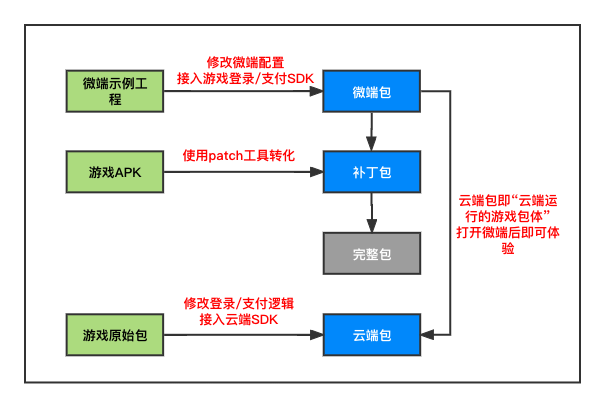
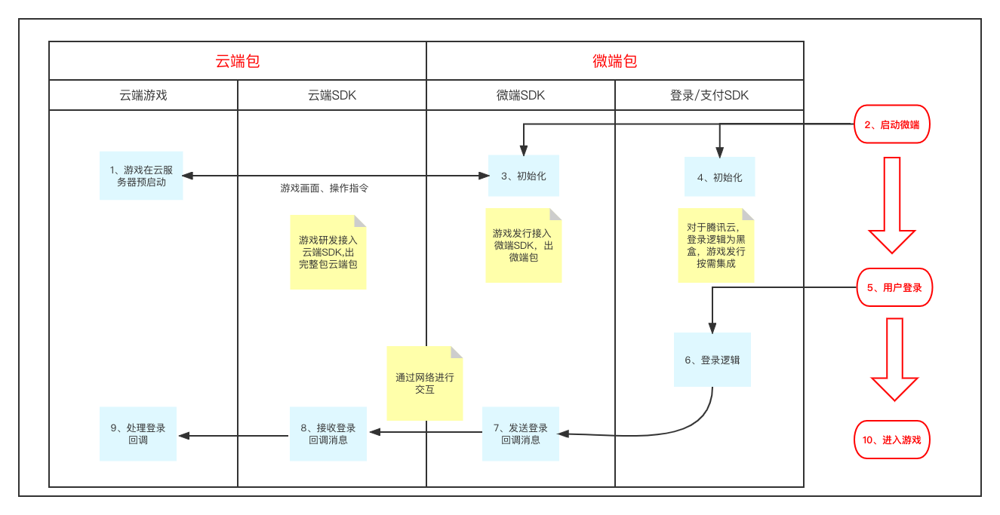

# 功能增强版

功能增强版在快速接入的基础上新增了登录/支付穿透、静默更新的功能。

&nbsp;

## 1. 整体流程概述



其中，

微端包是实现了登录/支付穿透和静默更新的包体，最终要投放到用户手中；

补丁包中含有游戏APK的资源，微端包运行时会去下载补丁包，下载完成后会去加载补丁包；

完整包是微端包加载补丁包之后的本地游戏，和游戏APK的功能一致；

云端包是游戏原始包接入云端SDK并实现登录/支付穿透之后部署到腾讯云服务器的包。

&nbsp;

接入的主要流程如下，

在游戏原始包中接入云端SDK，将登录/支付逻辑迁移到微端包中，生成云端包部署到腾讯云服务器。

在微端示例工程的基础上接入游戏登录/支付SDK，实现游戏原始包中的登录/支付逻辑，然后适配静默更新，生成微端包。

使用patch工具将游戏APK转化为补丁包，微端包运行过程中下载补丁包，静默更新到完整包。

&nbsp;

## 2. 功能接入指南

功能接入包含登录/支付穿透和静默更新，登录/支付穿透为可选功能，如果不需要可以直接进行静默更新的功能接入。

注意：不需要登录/支付穿透的直接把游戏APK给到工作人员部署到腾讯云服务器，生成对应的gameId即可，不需要对云端包和微端包进行适配。  

&nbsp;

### 2.1 核心功能--登录/支付穿透



登录/支付穿透的主要流程是，

首先，云端包在腾讯云服务器中会预启动，等待微端的连接；

然后，每个微端包在启动之后会初始化微端SDK和登录/支付SDK，通过微端SDK向云服务器请求一个云游戏实例，获取云游戏画面；

最后，微端操作过程中触发登录，微端包执行登录逻辑，并将处理之后的登录结果回调给云端包，云端包收到回调之后执行登录之后的逻辑。

支付操作同理。

&nbsp;

#### 2.1.1 云端包适配

在游戏原始包的基础上接入云端SDK，建立数据通道，迁移登录支付逻辑，生成云端包。

**详细步骤**：

第一步，打开游戏原始包工程，在app/build.gradle文件中添加云端SDK依赖。

```groovy
dependencies {
    implementation "com.tencent.tcr:micro-cloud-sdk:2.0.0"
}
```

云端sdk的具体使用方法请参考[云端SDK的API文档](https://tencentyun.github.io/cloudgame-android-sdk/microsdk/com/tencent/tcr/micro/cloudsdk/DataChannel.html)，同时云端包的适配可以参考[云端APP示例工程](../Demo/云端APP示例工程/TcrMicroCloud.zip).

&nbsp;

第二步，建立数据通道，移除登录/支付具体逻辑。

1）建立数据通道，开始监听微端发送的数据。监听的代码如下：

```java
   DataChannel.Listener listener = new DataChannel.Listener() {
        public void onReceive(byte[] buffer, int len) {
            // 从监听的端口接收到数据
            String dataFromRemote = new String(buffer, 0, len);
        }

        public void onException(Exception e) {
            // 数据接收或发送过程中出现异常
        }
    };
  
    // 建立并打开数据通道，开始监听
    mDataChannel = new DataChannel(listener, 6666);
    mDataChannel.open();
```

收到的数据可以是微端处理登录/支付之后生成的token或者一些自定义数据，云端包通过数据通道收到微端包处理的数据之后可以继续之前游戏原始包的登录/支付逻辑。

2）在需要登录/支付时通过数据通道向微端发起登录/支付指令。

登录/支付的具体逻辑需要迁移到微端包中，云端包不需要再处理，只需要在发起登录/支付时向微端包发送登录/支付指令，具体的登录/支付操作由微端包来处理。发送数据的方法如下：

```java
    /**
     * 通过此方法向发送方回复数据
     * 必须在数据通道连接成功后使用
     *
     * @param data 要发送的数据
     */
    public void sendData(String data) {
        if (mDataChannel != null) {
            mDataChannel.send(data.getBytes(Charset.forName("UTF-8")));
        }
    }
```

注意：发送数据必须在数据通道连接成功之后，该方法必须在**非UI线程**中调用。

&nbsp;

第三步，数据通道本地调试。

云端包需要部署到腾讯云服务器上才可以接收到微端包发送的数据，部署游戏相对比较复杂。因此需要在部署之前在本地测试数据通道的功能是否符合预期，测试方法如下：

下载[数据通道测试APP](../Demo/云端APP示例工程/DataChannelTest.zip)，解压之后通过AndroidStudio打开。模拟微端包发送数据，代码如下：

```java
    private void sendDataToCloud(String testData) {
        Log.d(TAG, "sendDataToCloud: " + testData);
        try {
            InetAddress address = InetAddress.getByName("localhost");
            DatagramPacket sendPacket = new DatagramPacket(testData.getBytes(Charset.forName("UTF-8")),
                    testData.length(), address, 6666);
            socket.send(sendPacket);
        } catch (IOException e) {
            e.printStackTrace();
        }
    }
```

先在手机上打开云端包，然后按home键回到桌面，再打开测试APP，点击test按钮向云端APP发送测试数据，过滤云端APP的相关log标签查看是否成功收到测试APP发送的数据。

&nbsp;

第四步，生成云端包并部署到腾讯云服务器。

本地调试成功之后，构建云端apk，并将该apk给到微信对接群中的工作人员，待游戏部署成功后向工作人员获取游戏ID。

&nbsp;

#### 2.1.2 微端包适配

在微端示例工程的基础上接入登录/支付SDK，实现登录/支付具体逻辑，将处理的结果发送给云端包。

&nbsp;

**详细步骤**：

第一步，下载[微端APP示例工程](../Demo/微端APP示例工程/TcrMicroAppForUnity2018Empty.zip)，解压并导入到AndroidStudio。

&nbsp;

第二步，通知云端的数据通道已连接成功。

```java
public class UnityPlayerActivity extends MicroBaseActivity {

    private boolean isConnectSuccess = false;

    ......

    @Override
    protected void onDataChannelConnectSuccess() {
        // 连接成功后可以向云端游戏发送信息，例如登录或者支付的结果
        isConnectSuccess = true;
        sendConnectMsg();
    }

    // 向云端发送链接成功
    private void sendConnectMsg() {
        Log.d(TAG, "向云端发送连接成功消息");
        try {
            JSONObject jsonObject = new JSONObject();
            jsonObject.put("connected", "连接成功");
            sendDataToCloudGame(jsonObject.toString());
        } catch (Exception e) {
            e.printStackTrace();
            Log.e(TAG, "sendConnectMsg exception");
        }
    }
}
```

在收到微端SDK的onDataChannelConnectSuccess回调之后，发送一条确认消息给云端(sendConnectMsg)，云端在收到这条确认消息之后才可以向微端发送登录/支付指令。

&nbsp;

第三步，迁移具体的登录支付逻辑。

添加登录/支付SDK的相关依赖，将游戏原始包中的登录/支付逻辑迁移到微端包中。

```java

public class UnityPlayerActivity extends MicroBaseActivity {
    
    ......

    @Override
    protected void onReceiveCloudGameMessage(String data) {
        // 接收云端游戏的返回信息
        if ("login".equals(data)) {
            login();
        } else if ("pay".equals(data)) {
            pay();
        }
    }

    // 处理支付操作
    private void pay() {
        Log.d(TAG, "pay: ");
    }

    // 处理登录操作
    private void login() {
        Log.d(TAG, "login: ");
    }

    // 向云端发送登录回调,在登录成功后调用
    private void sendLoginCall(String authCode) {
        if (!isConnectSuccess) {
            Log.d(TAG, "未连接成功，不能向云端发送登录回调");
            return;
        }
        Log.d(TAG, "向云端发送登录回调");
        try {
            JSONObject jsonObject = new JSONObject();
            jsonObject.put("auth_code", authCode);
            sendDataToCloudGame(jsonObject.toString());
        } catch (JSONException e) {
            e.printStackTrace();
            Log.e(TAG, "sendLoginCall exception");
        }
    }
}
```

&nbsp;

第四步，微端包与云端包连调。

打开工程assets下的microSettings.xml，填入云端包的对应参数

```xml
<?xml version="1.0" encoding="utf-8"?>
<settings>
    <!--云端包部署之后获取的游戏ID-->
    <setting key="game_id" value="game-xxxxx" />
    
    ......

    <!--与云端通信的端口号-->
    <setting key="port" value="6666" />

    ......
</settings>
```

云端包部署之后会获取到对应的gameId，将该gameId填入到微端配置参数中，端口号为云端包建立数据通道时开启的端口号。

修改之后构建微端包，安装到手机并打开，验证登录/支付穿透流程是否正常。

&nbsp;

### 2.2 核心功能--静默更新

静默更新是微端包加载补丁热更新到完整包的过程。

补丁包可以通过游戏APK生成，微端包进行适配之后加载补丁包来转化为完整包，整个转换过程都是静默的。

体验静默更新请下载并安装[微端体验apk](../Demo/微端APP示例工程/微端体验.apk)了解相关功能。

&nbsp;

#### 2.2.1 生成补丁包

安装java11环境，在AndroidStudio中打开[微端APP示例工程](../Demo/微端APP示例工程/TcrMicroAppForUnity2018Empty.zip)，在Terminal中进入到hotUpdate目录下，使用以下命令生成补丁包：

```shell
./generate_patch.sh 游戏APK路径
```

该脚本通过游戏APK生成补丁包。补丁包生成路径为：hotUpdate/out/patch.apk。

微端包经过热更新适配之后加载该补丁更新到完整包。

&nbsp;

#### 2.2.2 微端包适配

为了保证微端包能够正常升级到完整包，需要依赖游戏APK的R.txt文件和AndroidManifest.xml清单文件。R.txt文件保证热更新前后的resource ID保持不变，清单文件保证热更新前后app组件保持不变。

&nbsp;

**准备工作**：

第一步，通过游戏APK获取R.txt文件。

在Terminal中进入到工程的hotUpdate目录下，使用以下命令生成R.txt：

```shell
./generate_resource_id.sh 游戏APK路径
```

该脚本主要通过aapt2命令提取游戏原始apk中的资源名称和ID，最终生成R.txt。

R.txt文件生成路径为：hotUpdate/out/R.txt。

注意：使用该脚本之前需要将aapt2添加到环境变量，需要修改脚本中的ANDROID_HOME替换为自己本地的路径，并选择自己本地的build-tools的版本。

&nbsp;

第二步，通过游戏APK获取AndroidManifest.xml文件。

在Terminal中进入到工程的hotUpdate目录下，使用以下命令生成AndroidManifest.xml：

```shell
./generate_manifest.sh 游戏APK路径
```

该脚本主要通过apktools反编译获取游戏原始apk的AndroidManifest.xml文件。

AndroidManifest.xml文件生成路径为hotUpdate/out/AndroidManifest.xml。

&nbsp;

**详细步骤**：

第一步，修改构建脚本。

打开app模块下的build.gradle文件，修改applicationId、minSdkVersion、targetSdkVersion与您的游戏工程一致。

```groovy
defaultConfig {
        // 应用名称和您的游戏包名一致
        applicationId "com.DefaultCompany.Unity2018Empty"
        // 与你的游戏版本保持一致
        minSdkVersion 21 // 微端SDK最低支持到16
        //noinspection ExpiredTargetSdkVersion,OldTargetApi
        targetSdkVersion 29 // 与你的游戏版本保持一致
        ndk {
            abiFilters 'armeabi-v7a', 'arm64-v8a'
        }
        versionCode rootProject.ext.versionCode
        versionName rootProject.ext.versionName
        multiDexEnabled true
        multiDexKeepProguard file('multidex-config.pro')
    }
```

修改签名文件与您的更新包工程一致。

```groovy
signingConfigs {
        release {
            keyAlias "testres"
            keyPassword "testres"
            storePassword "testres"
            storeFile file("keystore/micro.keystore")
        }
    }
```

&nbsp;

第二步，替换AndroidManifest.xml文件。

将准备工作中获取的hotUpdate/out/AndroidManifest.xml文件拷贝到微端工程的对应目录下，替换工程的AndroidManifest.xml。在该文件里声明的Application类和4大组件类，在微端工程里不存在的，会编译报错，可以使用IDE的Quick Fix功能创建对应的空类占位。

&nbsp;

第三步，修改工程代码。

将MyApplication和UnityPlayerActivity里的代码拷贝到新AndroidManifest.xml文件里声明的Application类和主Activity类里。把原MyApplication和UnityPlayerActivity类删掉。

&nbsp;

第四步，修改工程配置。

打开工程assets下的microSettings.xml，修改对应参数

```xml
<?xml version="1.0" encoding="utf-8"?>
<settings>
    ......
    <!--    patch存放的位置，功能增强版接入需要填入-->
    <setting key="patch_url"
            value="https://cg-sdk-1258344699.cos.ap-nanjing.myqcloud.com/micro/patch/TcrMicroAppForUnity2018Empty/patch.apk" />
    ......
</settings>
```

在配置文件中填写patch文件的下载链接，可以选择自己维护这个链接。

&nbsp;

第五步（可选），修改游戏启动背景。

替换assets中的loading.png即可替换游戏启动背景。

&nbsp;

第六步，构建生成微端apk，并校验微端apk生成是否正常。

构建生成微端apk后，在Terminal中进入到hotUpdate目录下，使用以下命令校验微端包：

```shell
./check_old_config.sh 微端apk路径 游戏APK路径
```

该脚本检查微端apk的清单文件是否和游戏原始apk一致，并输出检查结果。

可以正常校验通过没有ERROR信息即为正常。校验结果将生成到hotUpdate/check_result目录下。

校验失败请检查第二步操作是否正确。

&nbsp;

第七步，本地调试验证。

在Terminal中进入到hotUpdate目录下，使用以下命令进行本地调试：

```shell
./local_debug.sh 微端apk路径 补丁包路径
```

该脚本将生成的补丁包通过adb命令push到手机的Download目录下，并通过adb卸载之前的微端包，安装新的微端包。

注意：需要先adb连接要调试的设备，修改脚本中要卸载微端的包名。

在手机上点击刚安装的apk，运行之后会提示“检测到本地补丁包“的弹窗，点击“加载补丁”选取刚才push到sd卡Download中的补丁文件，选择完毕后悬浮球显示更新中，更新完成弹出“重启弹窗”，点击“立即重启“按钮，查看是否可以正常重启。

&nbsp;

第八步，本地调试验证成功后，删除sd卡Download中的补丁文件，并将补丁包上传到第四步的下载地址中开始验证。

## 3. 注意事项

### 3.1 游戏工程的minSDK<21时微端包的mutidex规则

如果游戏工程的minSDK<21，则需要在微端包中新增mutidex配置文件。

在app目录下新建mutidex-config.pro文件，在该文件中新增以下内容。

```groovy
-keep class com.tencent.bugly.beta.tinker.**{*;}
-keep class com.bytedance.android.** {*;}
-keep class com.tencent.tinker.** {*;}
-keep class androidx.multidex.**{*;}
```

同时在app模块的build.gradle文件中新增对mutidex-config.pro文件的引用。

```groovy
defaultConfig {
    ...
    multiDexEnabled true
    multiDexKeepProguard file('multidex-config.pro')
}
```

最后需要把补丁包生成工具的配置文件tinker_config.xml中的allowLoaderInAnyDex和removeLoaderForAllDex改为false。

```xml
<issue id="property">
        ......
        
        <!-- use in minSDK>=21 -->
        <!-- when minSDK<21, please make allowLoaderInAnyDex and removeLoaderForAllDex all false-->
        <allowLoaderInAnyDex value="true" />
        <removeLoaderForAllDex value="true" />
</issue>
```

&nbsp;

## 4. 资源汇总

[微端包示例工程](../Demo/微端APP示例工程/TcrMicroAppForUnity2018Empty.zip)

[游戏包示例工程](../Demo/游戏APP示例工程/AndroidUnity2018Empty.zip)

[云端包示例工程](../Demo/云端APP示例工程/TcrMicroCloud.zip)

[微端体验APK](../Demo/微端APP示例工程/微端体验.apk)
