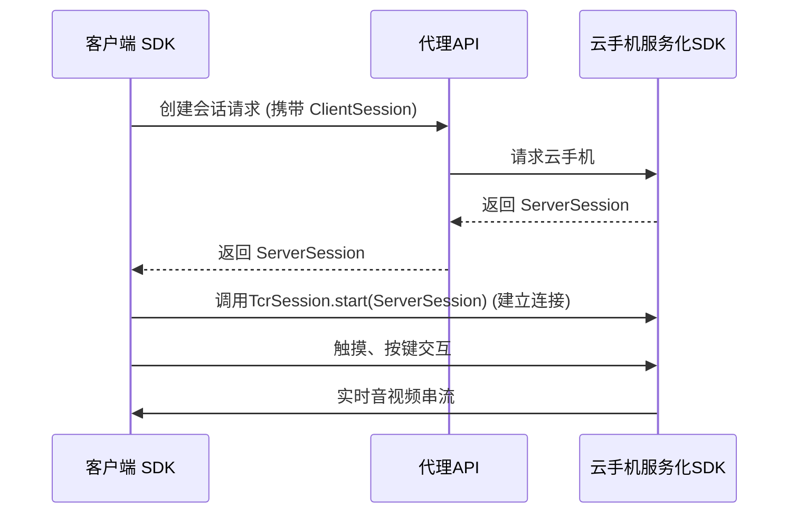

> ⚠️ **注意：本集成文档适用于“真实手机”客户端（即最终用户的 Android 手机）集成 Android SDK。**
> 
> 本文档**不适用于云手机（云端 Android 设备）上的服务化 SDK 开发**。如需开发云手机端服务，请参考云机服务化 SDK 的相关文档。
## 1. 前后端架构概览

云渲染串流服务由**云机服务化SDK**、**代理API**和**客户端 SDK**组成：

- **云机服务化SDK**: 运行在云手机的服务
- **代理API**：通过 HTTP/RESTful API 实现创建会话接口，以交换ClientSession和ServerSession
- **客户端 SDK**：运行在**真实用户的 Android 手机**，用于接入云渲染服务(实时串流、事件交互、自定义数据通道等功能)。
#### 整理交互流程如下:



## 2. SDK 集成指引
#### 2.1 SDK集成
在应用模块的'build.gradle'中引用
```
implementation 'com.tencent.tcr:tcrsdk-full:3.27.0'
```
#### 2.2 SDK使用

1.**初始化SDK**
首先需要初始化TcrSdk，建议在`Activity`的`onCreate`方法中调用：
```
TcrSdk.TcrConfig config = new TcrSdk.TcrConfig();
config.ctx = this; // Context
config.type = TcrSdk.SdkType.CloudStream; // 云串流类型
config.callback = new AsyncCallback<Void>() {
    @Override
    public void onSuccess(Void result) {
        // SDK初始化成功
    }
    @Override
    public void onFailure(int code, String msg) {
        // SDK初始化失败
    }
};
TcrSdk.getInstance().init(config);
```

2.**创建会话对象**
SDK初始化成功后，通过`TcrSdk.getInstance().createTcrSession()`创建会话对象，并设置事件观察者：
```
TcrSessionConfig tcrSessionConfig = TcrSessionConfig.builder()
    .observer(mSessionEventObserver) // 事件回调
    .build();
TcrSession mTcrSession = TcrSdk.getInstance().createTcrSession(tcrSessionConfig);
```

3.**创建渲染视图**
创建渲染视图用于显示云端画面：
```
TcrRenderView mRenderView = TcrSdk.getInstance()
    .createTcrRenderView(this, mTcrSession, TcrRenderViewType.TEXTURE);
// 添加到布局
((FrameLayout) findViewById(R.id.render_view_parent)).addView(mRenderView);
```

4.**会话建立与连接**
- 监听`STATE_INITED`事件，获取`ClientSession`，通过请求 HTTP/RESTful API 实获取`ServerSession`。
- 调用`mTcrSession.start(serverSession)`建立连接。
```
// 事件回调
private final TcrSession.Observer mSessionEventObserver = new TcrSession.Observer() {
    @Override
    public void onEvent(TcrSession.Event event, Object eventData) {
        switch (event) {
            case STATE_INITED:
                String clientSession = (String) eventData;
                // 通过API获取serverSession后，启动会话
                requestServerSession(clientSession);
                break;
            case STATE_CONNECTED:
                // 连接成功后可进行交互
                mRenderView.setOnTouchListener(new MobileTouchListener(mTcrSession));
                createCustomDataChannel();
                break;
            // 其他事件...
        }
    }
};
```

5.**触摸与按键事件交互**
- 触摸事件：通过`MobileTouchListener`将本地触摸映射到云端。
- 按键事件：通过`mTcrSession.getKeyboard().onKeyboard(keyCode, isDown)`发送按键。
```
// 触摸
mRenderView.setOnTouchListener(new MobileTouchListener(mTcrSession));

// 按键
mTcrSession.getKeyboard().onKeyboard(KEY_MENU, true);  // 按下
mTcrSession.getKeyboard().onKeyboard(KEY_MENU, false); // 松开
```

6.**自定义数据通道**
支持自定义数据通道进行双向通信：
```
CustomDataChannel mCustomDataChannel = mTcrSession.createCustomDataChannel(10000, new CustomDataChannel.Observer() {
    @Override
    public void onConnected(int port) {
	    // 发送数据到云端
        String msg = "Your message";
        mCustomDataChannel.send(ByteBuffer.wrap(msg.getBytes(StandardCharsets.UTF_8)));
    }
    @Override
    public void onMessage(int port, ByteBuffer data) {
        // 处理收到的数据
    }
    @Override
    public void onError(int port, int code, String msg) {
        // 错误处理
    }
});
```

7.**性能数据与会话状态监听**
通过`CLIENT_STATS`事件获取实时性能数据（如fps、bitrate、rtt），通过`STATE_CLOSED`等事件处理会话关闭等状态。

8.**释放资源**
```
@Override
protected void onDestroy() {
    super.onDestroy();
    if (mTcrSession != null) {
        mTcrSession.close();
    }
    if (mRenderView != null) {
        mRenderView.release();
    }
}
```
#### 2.3 日志收集与问题反馈
为便于定位和排查集成过程中遇到的问题，建议开发者在接入 SDK 时务必收集 SDK 日志。
SDK 提供了日志回调接口，开发者可通过设置 `TcrLogger` 实现日志的统一收集和输出。日志内容在出现异常或 bug 时，可作为问题反馈的重要依据，帮助我们更快定位和解决问题。
请在初始化 SDK 时设置如下日志回调：
```
config.logger = new TcrLogger() {
    @Override
    public void v(String tag, String msg) {
        // 建议输出到本地日志系统或文件
    }

    @Override
    public void d(String tag, String msg) {
        // 建议输出到本地日志系统或文件
    }

    @Override
    public void i(String tag, String msg) {
        // 建议输出到本地日志系统或文件
    }

    @Override
    public void e(String tag, String msg) {
        // 建议输出到本地日志系统或文件
    }

    @Override
    public void w(String tag, String msg) {
        // 建议输出到本地日志系统或文件
    }
};
```

## 3. 参考资料
SDK API文档: https://tencentyun.github.io/cloudgame-android-sdk/tcrsdk/3.27.0/index.html