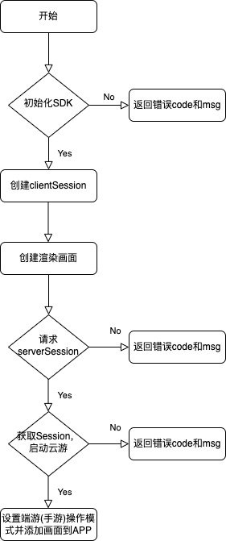

- [英文文档](Real-Time_Cloud_Rendering_SDK_Integration_Guide.md)

# 准备工作
请先理解腾讯云渲染的业务逻辑和前后端交互流程，申请好腾讯云渲染服务和搭建好业务后台程序。（参考[链接](../README.md)）

# 调用云渲染Android SDK的主要流程
<br>

<br>

# 接入云渲染SDK的步骤

1. 集成SDK。在应用模块的'build.gradle'中引用

```java
implementation 'com.tencent.tcr:tcrsdk-full:3.4.1'
```

如果选择集成轻量版SDK，则引用

```java
implementation 'com.tencent.tcr:tcrsdk-full:3.4.1' 
```

2. AndroidManifest 配置网络权限：

```java
<uses-permission android:name="android.permission.ACCESS_NETWORK_STATE" />
<uses-permission android:name="android.permission.INTERNET" />
```

3. 初始化SDK

```java
// 初始化SDK
TcrSdk.getInstance().init(this, null, mInitSdkCallback);
```

如果引用的是轻量版SDK，则需要应用先下载SDK插件，再调用init()函数时通过第二个参数传入插件文件的路径。下载SDK插件的URL可以通过 TcrSdk.getPluginUrl() 获取。

4. 初始化SDK，异步回调成功后，可以创建和初始化会话对象、渲染视图。

```java
// 创建和初始化会话对象
TcrSessionConfig tcrSessionConfig = TcrSessionConfig.builder()
        .setObserver(mSessionEventObserver)
        .connectTimeout(25000)
        .idleThreshold(30)
        .build();
mTcrSession = TcrSdk.getInstance().createTcrSession(tcrSessionConfig);
// 创建和添加渲染视图
mRenderView = TcrSdk.getInstance().createTcrRenderView(MainActivity.this, mTcrSession, TcrRenderViewType.SURFACE);
((FrameLayout) MainActivity.this.findViewById(R.id.render_view_parent)).addView(mRenderView);
// 为会话设置渲染视图
mTcrSession.setRenderView(mRenderView);
```

5. 创建会话对象后会自动初始化对象，初始化成功后会通过步骤4传入的mSessionEventObserver对象向外通知事件。其中Session初始化完成的事件为TcrSession.Event.EVENT_INITED，在通知的事件中获得clientSession，用于进一步请求业务后台，再调用云API，启动指定应用实例并返回serverSession。客户端调用会话对象的start()接口传入serverSession参数，就可以启动会话，发起SDK到云端的连接。启动会话异步回调成功后，客户端程序就会显示出云端应用的画面。 
事件通知:

```java
private final TcrSession.Observer mSessionEventObserver = new TcrSession.Observer() {
        @Override
        public void onEvent(TcrSession.Event event, Object eventData) {
            switch (event) {
                case STATE_INITED:
                    // 回调数据中拿到client session并请求ServerSession
                    String clientSession = (String) eventData;
                    requestServerSession(clientSession);
                    break;
                case STATE_CONNECTED:
                    // 连接成功后设置操作模式
                    // 与云端的交互需在此事件回调后开始调用接口
                    runOnUiThread(() -> setTouchHandler(mTcrSession, mRenderView, PC_GAME));
                    break;
                default:
            }
        }
   };    

```

请求ServerSession并启动游戏:

```java
CloudRenderBiz.getInstance().startGame(clientSession, response -> {
            Log.i(TAG, "Request ServerSession success, response=" + response.toString());
            // 使用从服务端获取到的server session启动会话
            StartGameResponse result = new Gson().fromJson(response.toString(), StartGameResponse.class);
            if (result.code == 0) {
                boolean res = mTcrSession.start(result.sessionDescribe.serverSession);
                if (!res) {
                    Log.e(TAG, "start session failed");
                    showToast("连接失败，请查看日志", Toast.LENGTH_SHORT);
                }
                showToast("连接成功", Toast.LENGTH_SHORT);
            } else {
                String showMessage = "";
                switch (result.code) {
                    case 10000:
                        showMessage = "sign校验错误";
                        break;
                    case 10001:
                        showMessage = "缺少必要参数";
                        break;
                    case 10200:
                        showMessage = "创建会话失败";
                        break;
                    case 10202:
                        showMessage = "锁定并发失败，无资源";
                        break;
                    default:
                }
                showToast(showMessage + result.msg, Toast.LENGTH_LONG);
            }
        }, error -> Log.i(TAG, "Request ServerSession success, response=" + error.toString()));
```

请求业务后台的接口由业务自定义，在[Demo](../Demo)例子中，封装在CloudRenderBiz类里。

6. 除了能在客户端上看到云端应用的画面，我们通常还需要能操作应用，即把客户端的操作同步给云端。SDK提供了KeyBoard、Mouse、GamePad等抽象对象，客户端可以调用这些对象的接口，实现与云端输入设备的交互。  
同时，Android SDK还实现了默认的屏幕触摸处理器：MobileTouchListener 和 PcTouchListener。MobileTouchListener针对云端为手机应用的场景，将本地屏幕触摸事件同步给云端；PcTouchListener针对云端为PC应用的场景，将本地屏幕触摸事件转化为云端的鼠标移动、单击、长按、双击事件。您也可以自定义实现自己的屏幕触摸处理器。将屏幕触摸处理器设置给TcrRenderView即可使用。

```java
// 手机应用
renderView.setOnTouchListener(new MobileTouchListener(session));

// PC应用
renderView.setOnTouchListener(new PcTouchListener(session));
```

<br><p>
**以上就是接入的核心步骤，具体代码可以参考[Demo](../Demo)。
API使用方法参考[API文档](API文档.md)。
更多功能场景的实现参考[场景功能](场景功能.md)。** 

# FAQs
1. **云渲染SDK支持的最低Android系统版本。**  
Android 4.1（API 级别 16）。

2. **完整版SDK 和 轻量版SDK，该如何选择。**  
轻量版SDK需要客户端程序先从网络上下载插件文件，在初始化SDK时传入给SDK进行动态加载。除此之外，二者在使用接口上并无区别。如果您对APP包体积大小有严格要求，可以选择集成轻量版SDK；否则，推荐使用完整版SDK。
