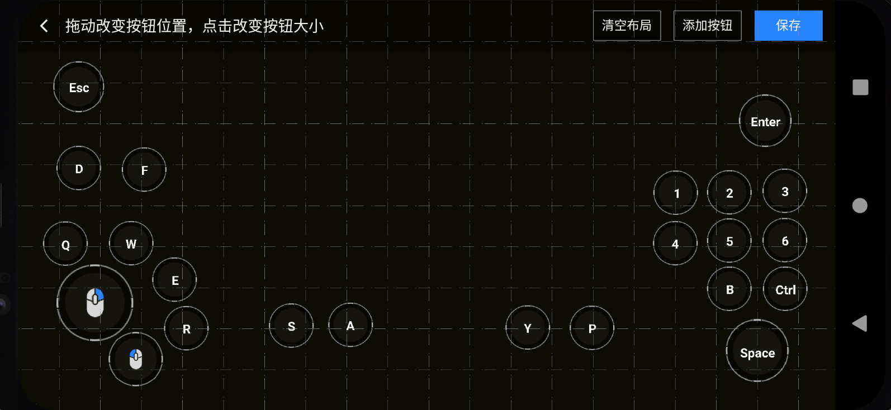

# 自定义虚拟按键

本文档主要介绍如何为您的游戏添加和使用虚拟按键。

自定义虚拟按键是在云渲染SDK集成基础上，可以在您的游戏中添加和使用虚拟按键的SDK组件。

我们在虚拟按键的SDK中提供了便捷的编辑功能，您接入之后可以动态生成自定义的虚拟按键。

同时你还可以通过虚拟手柄[配置文件生成工具](../Tools/vktool-release.apk)，生成默认的手柄布局(Demo工程中已生成两类常用布局，lol_5v5和pc_demo手柄布局)。

<br>

<br>
## 功能介绍

您只需根据业务需求在合适的位置调用`mGamePadManager.editCustomGamePad(true)`开启虚拟按键的编辑界面。

### 支持的按键

支持的按键主要分为三类，鼠标及摇杆、键盘、手柄。

#### 鼠标及键盘十字键

1、鼠标按键（左、中、右、上滚、下滚）

2、键盘十字键（上下左右、WASD）
    将W、A、S、D四个常规键盘按键合成一个类似游戏手柄的十字方向键，按压正上方时触发'W'按键消息，按45度角同时触发相邻两个按键。
    上下左右十字键触发按键消息类同。

#### 键盘常规按键

1、实体键盘中常用的78个按键

#### 手柄

1、左、右摇杆键 

2、手柄十字键

3、普通点击按键（A、B、X、Y、△、☐、×、○、Select、Start、LB、RB、L3、R3）

4、延时扳机键（LT、RT）【*点击时在短时间内连续发多次消息，消息的力度随时间逐增减*】

### 支持的编辑功能

- 动态添加/删除按键
- 动态调整按键位置、大小
- 通过辅助线定位按键
- 点击类按键支持修改名称(最多显示6个字符)

注：UI切图等资源暂不支持动态设置

## 接口介绍

| 接口名称                                                     | 接口描述                 |
| ------------------------------------------------------------ | ------------------------ |
| GamepadManager.setEditListener(OnEditListener listener)      | 设置虚拟按键编辑事件监听 |
| GamepadManager.setGamePadTouchDelegate(IGamepadTouchDelegate delegate) | 设置触摸事件的代理 |
| GamepadManager.showGamepad(String jsonCfg)                   | 显示虚拟手柄             |
| GamepadManager.editGamepad(String jsonCfg)                   | 编辑虚拟手柄             |
| GamepadManager.needConnected()                               | 判断是否为手柄按键       |

#### OnEditListener.onFinishEdit(boolean isChanged, String jsonCfg)

| 参数       | 类型    | 返回值 | 描述                   |
| ---------- | :------ | :----- | ---------------------- |
| isChanaged | boolean | 无     | 配置文件是否发生更改   |
| jsonCfg    | String  | 无     | 更改之后的配置文件内容 |

#### IGamepadTouchDelegate.onTouch(View view, MotionEvent event)

| 参数  | 类型        | 描述         |
| ----- | :---------- | ------------ |
| view  | View        | 按键代理视图 |
| event | MotionEvent | 触摸事件     |
#### KeyboardView:虚拟键盘视图

## 接入自定义虚拟按键SDK步骤

1、 虚拟按键组件依赖云渲染SDK，请在您的应用里先集成[云渲染SDK](入门指南.md)

2、集成SDK。在应用模块的`build.gradle`中加入：

```groovy
dependencies {
	 ......
    implementation 'com.tencent.tcr:tcr-gamepad:2.0.0'
}
```

3、初始化虚拟按键视图，读取配置文件

``` java
mGamePadManager = new GamepadManager(getApplicationContext());
mCustomGamePadCfg = readConfigFile("lol_5v5.cfg");  //读取文件方式可自行实现
```

4、初始化虚拟键盘

```java
mKeyboardView = new KeyboardView(getApplicationContext());

```
5、添加自定义编辑监听器

```java
mGamePadManager.setEditListener((isChanged, newCfg) -> {
            if (isChanged){
                mCustomGamePadCfg = newCfg;
            }
            mGamePadManager.showGamepad(mCustomGamePadCfg); // 编辑后更新新的按键视图
        });
```

6、打开虚拟按键视图

```java
mGamePadManager.showGamepad(mCustomGamePadCfg); // 打开虚拟按键
```
7、打开关闭编辑视图

```java
mGamePadManager.editGamepad(mCustomGamePadCfg); // 打开自定义编辑视图
```

**以上就是接入的核心步骤，具体代码可以参考[Demo](../Demo)**


## 配置文件生成

我们还提供了[自定义虚拟按键的配置](../Tools/vktool-release.apk)工具，您可以使用该工具生成的按键布局配置供SDK使用。同时您还可以在自己的代码中将`OnEditListener.onFinishEdit(boolean isChanged, String jsonCfg)`回调中的jsonCfg保存到本地，这个就是编辑完成之后的配置文件内容。

注：您不需要关心配置文件中的内容以及生成规则，您只需要导入和保存生成的配置文件供游戏使用。

## FAQ
1. **虚拟按键SDK支持的最低Android系统版本。**  
Android 5.0（API 级别 21）。
