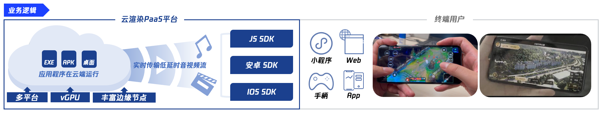
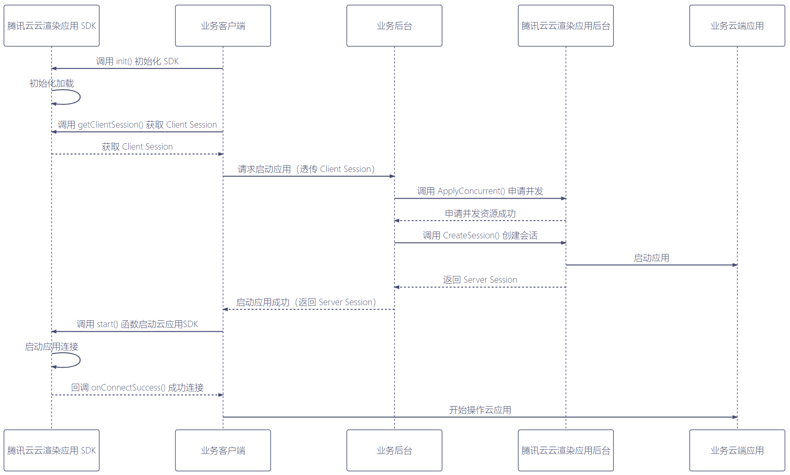

- [English document](README_EN-US.md)


# 腾讯云渲染Android
云渲染是指在云端渲染3D应用，利用串流技术将画面实时推送到终端显示，并且让用户可以通过终端与云端应用进行实时的交互操作。
它可以解决终端算力不足，用户需提前安装配置复杂的软件，终端一次性采购成本高的问题。
<br><br>

<br><br>
腾讯云渲染是前后端一体的PaaS平台产品，提供了各平台客户端SDK和后端API。您需要搭建自己的业务客户端程序和业务后台程序，才能运行看到云渲染的效果。

云渲染下有两类业务场景，分别为[云游戏](https://cloud.tencent.com/document/product/1162)和[应用云渲染](https://cloud.tencent.com/document/product/1547)。

腾讯云云游戏依托腾讯丰富的边缘计算节点、灵活的GPU虚拟化技术、稳定低延时的音视频互动能力，为游戏开发者提供一站式的云游戏 PaaS 解决方案。开发者无需适配不同的软硬件平台，即可快速部署上线，让玩家在各类终端和场景下，无需安装即可获得3A级的游戏体验。

应用云渲染依托腾讯丰富的边缘计算节点、灵活的GPU虚拟化技术、稳定低延时的音视频串流能力，帮助您将应用客户端云化，使得用户无需下载应用包体，仅需打开视频画面即可操作体验云上应用。同时，应用云渲染提供云API+全端SDK，满足您的用户在各类终端以及业务场景下的需要。
<br><br>

<br><br>
创建业务后台程序可以参考这个[应用云渲染业务后台Demo](https://github.com/tencentyun/car-server-demo)([云游戏业务后台Demo](https://github.com/tencentyun/gs-server-demo))，创建客户端程序可以参考下面的[入门指南](Doc/云渲染SDK接入指南.md)。在此之前您还需要先[申请](https://cloud.tencent.com/document/product/1162/46135)腾讯云渲染服务。

腾讯云渲染Android SDK管理了终端和云端的会话连接，数据通道、音视频轨道，可以上下行文本和音视频数据；提供和云端虚拟设备、应用交互的上层接口；进行串流画面的本地渲染，缩放旋转操作，本地触屏事件到云端操作的映射，视图-视频-云端坐标系的转换。让您可以快速开发出业务客户端程序。

本仓库目录存放了腾讯云渲染Android SDK的相关资料。

# 历史版本
请跳转到[最新版本](发布记录.md)。

# 目录说明

```shell
.
├── Demo
│   ├── SimpleLightDemo.zip
│   ├── SimpleDemo.zip
│   ├── VKtoolDemo.zip
│   └── ExperienceDemo.apk
├── Doc
│   ├── 云渲染SDK接入指南.md
│   ├── 自定义虚拟按键接入指南.md
│   └── API文档.md
│── Sdk
│   └── README.md
│── Tools
│   ├── vktool-release.apk
│   └── README.md
├── LICENSE
├── README.md
└── 发布记录.md
```


## Demo

[该目录](Demo)下有三个示例工程和一个用于体验的apk。三个示例工程分别是云游戏/云应用入门Demo、轻量版SDK入门Demo以及自定义虚拟按键Demo。

云游戏/云应用入门Demo [SimpleDemo.zip](Demo/SimpleDemo.zip) 演示了如何集成云渲染Android SDK，构建业务客户端程序。

云渲染Android SDK采用插件化设计，对外提供 完整版SDK 和 轻量版SDK，两个版本的使用接口一致。如果您的App十分在意安装包体积大小，可以选择轻量版SDK，集成的体积增量仅65KB，运行时再从网络下载SDK插件（9MB）后进行动态加载。轻量版SDK入门Demo [SimpleLightDemo.zip](Demo/SimpleLightDemo.zip)演示了这一过程。

自定义虚拟按键Demo [VKtoolDemo.zip](Demo/VKtoolDemo.zip) 演示了如何集成自定义虚拟按键SDK，并在应用中自定义编辑您所需要的按键功能。

[TCRExperienceDemo.apk](Demo/TCRExperience.apk)是云应用体验App的安装包。您可以在腾讯云控制台生成云端应用的体验码，然后输入到这个App里体验云端应用。


## Doc

[该目录](Doc)下存放了一些接入说明文档，包括[云渲染SDK接入指南](Doc/云渲染SDK接入指南.md)、[自定义虚拟按键接入指南](Doc/自定义虚拟按键接入指南.md)和[API文档](Doc/API文档.md)。

## Sdk
[该目录](Sdk)下主要存放了云渲染相关的SDK及说明。 
