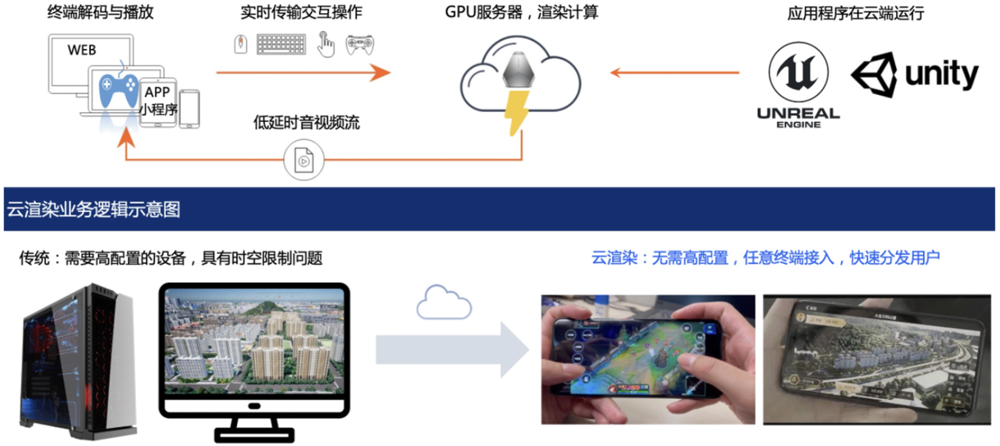

# 腾讯云渲染Android
云渲染是指在云端渲染3D应用，利用串流技术将画面实时推送到终端显示，并且让用户可以通过终端与云端应用进行实时的交互操作。
它可以解决终端算力不足，用户需提前安装配置复杂的软件，终端一次性采购成本高的问题。
<br><br>

<br><br>
腾讯云渲染是前后端一体的PaaS平台产品，提供了各平台客户端SDK和后端API。您需要搭建自己的业务客户端程序和业务后台程序，才能运行看到云应用的效果。
<br><br>

<br><br>
创建业务后台程序可以参考这个[链接](https://cloud.tencent.com/document/product/1162/65429#upload)。在此之前您还需要先[申请](https://cloud.tencent.com/document/product/1162/46135)腾讯云渲染服务。

腾讯云渲染Android SDK管理了终端和云端的会话连接，数据通道、音视频轨道，可以上下行文本和音视频数据；提供和云端虚拟设备、应用交互的上层接口；进行串流画面的本地渲染，缩放旋转操作，本地触屏事件到云端操作的映射，视图-视频-云端坐标系的转换。让您可以快速开发出业务客户端程序。

本仓库目录存放了腾讯云渲染Android SDK的相关资料。

# 历史版本
请跳转到[最新版本](发布记录.md)。

# 目录说明

```shell
.
├── Demo
│   ├── SimpleLightDemo.zip
│   ├── SimpleMoblieDemo.zip
│   ├── SimplePCDemo.zip
├── Doc
│   ├── 入门指南.md
│   ├── API文档.md
│── Sdk
│   ├── README.md
├── LICENSE
├── README.md
└── 发布记录.md
```

## Demo

[该目录](Demo)下有三个示例工程，分别是端游入门Demo、手游入门Demo 和 轻量版SDK入门Demo。

端游入门Demo [SimplePCDemo.zip](Demo/SimplePCDemo.zip) 和 手游入门Demo [SimpleMoblieDemo.zip](Demo/SimpleMoblieDemo.zip) 演示了如何集成云渲染Android SDK，构建业务客户端程序。

云渲染Android SDK采用插件化设计，对外提供 完整版SDK 和 轻量版SDK，两个版本的使用接口一致。如果您的App十分在意安装包体积大小，可以选择轻量版SDK，集成的体积增量仅65KB，运行时再从网络下载SDK插件（9MB）后进行动态加载。轻量版SDK入门Demo [SimpleLightDemo.zip](Demo/SimpleLightDemo.zip)演示了这一过程。

## Doc

[该目录](Doc)下存放了一些接入说明文档，包括[入门指南](Doc/入门指南.md)、[API文档](Doc/API文档.md)。

## Sdk
[该目录](Sdk)下主要存放了云渲染相关的SDK及说明。
