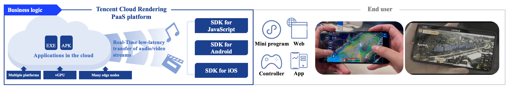
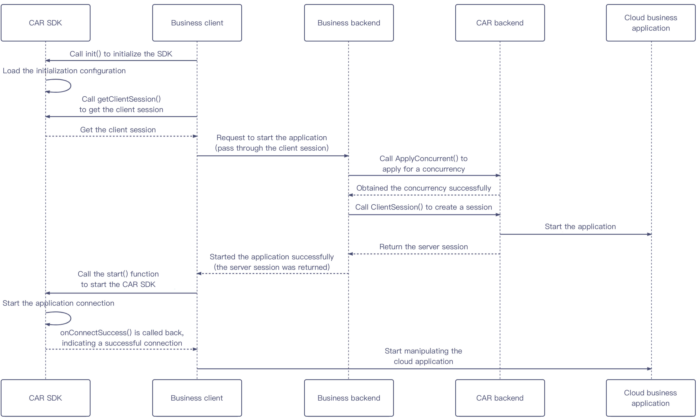
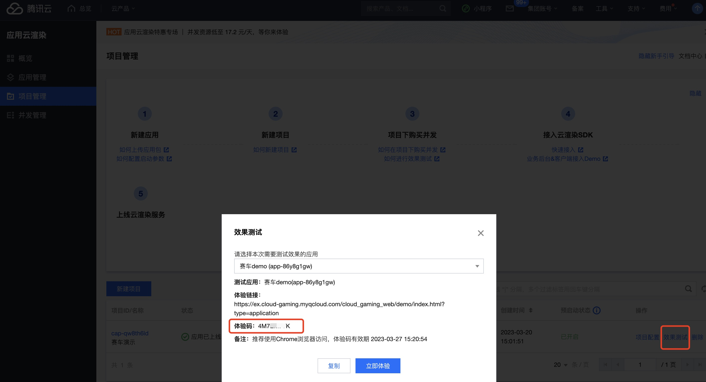

- [中文文档](README.md)

# Real-Time Cloud Rendering for Android
Cloud rendering refers to rendering a 3D application in the cloud and using streaming technology to push the image to the end-user’s device. The cloud application is displayed on the device, and the user can interact with it in real time.
Cloud rendering allows users to use a cloud application even if their device has relatively low computing power. There is also no need to install and configure complex software programs, and the up-front costs of purchasing high-end computing devices can be greatly reduced.
<br><br>

<br><br>

Tencent Cloud Real-Time Cloud Rendering is a frontend/backend integrated PaaS product that comes with client SDKs and backend APIs for various platforms. You need to build your own business client and backend programs to run your cloud applications.

There are two types of business scenarios under cloud rendering, whitch are [GS](https://cloud.tencent.com/document/product/1162) and [CAR](https://www.tencentcloud.com/products/car?lang=en&pg=)。

Cloud Games streaming relies on Tencent's rich edge computing nodes, flexible GPU virtualization technology, and stable and low-latency audio and video interaction capabilities to provide game developers with a one-stop cloud game PaaS solution. Developers can quickly deploy and go online without adapting to different software and hardware platforms, allowing players to obtain a AAA level gaming experience in various devices and scenarios without installation.

Cloud application rendering  relies on Tencent's rich edge computing nodes, flexible GPU virtualization technology, and stable and low-latency audio and video streaming capabilities to help you cloud the application client, so that users do not need to download the application package, but only need to open the video The screen can operate and experience the application on the cloud. At the same time, App Cloud Rendering provides cloud API + full-end SDK to meet the needs of your users in various devices and business scenarios.
<br><br>

<br><br>
You can create a business backend program and a client program as instructed in Creating Backend Program [CAR](https://github.com/tencentyun/car-server-demo)(or[GS](https://github.com/tencentyun/gs-server-demo)) and [Getting Started](Doc/Real-Time_Cloud_Rendering_SDK_Integration_Guide.md) respectively. Before this, you need to [apply to](https://www.tencentcloud.com/document/product/1158/49612) activate Real-Time Cloud Rendering first.

The Real-Time Cloud Rendering SDK for Android manages session connections, data channels, and audio/video tracks of the client and cloud. It can upstream/downstream text, audio, and video data, provide upper-layer APIs for interaction with cloud virtual devices and applications, render, zoom, and rotate the streamed video image locally, map local touchscreen events to cloud operations, and convert between the view, video, and cloud coordinates, enabling you to quickly develop a business client program.

The repository directory in this document stores the materials of the Real-Time Cloud Rendering SDK for Android.

# Historical Versions
See the [latest version](Release_Notes.md).

# Directory Description

```shell
.
├── Demo
│   ├── SimpleLightDemo.zip
│   ├── SimpleDemo.zip
│   ├── VKtoolDemo.zip
│   └── ExperienceDemo.apk
├── Doc
│   ├── Real-Time_Cloud_Rendering_SDK_Integration_Guide.md
│   ├── Custom_Virtual_Key_Integration_Guide.md
│   └── API_Documentation.md
│── Sdk
│   └── README.md
│── Tools
│   ├── vktool-release.apk
│   └── README.md
├── LICENSE
├── README_EN-US.md
└── Release_Notes.md
```


## Demo

[This directory](Demo) has two demo projects: `TcrDemo`and `VKtoolDemo`.

[TcrDemo](Demo/TcrDemo) demonstrate how to integrate the Real-Time Cloud Rendering SDK for Android to build a business client program.

The Real-Time Cloud Rendering SDK for Android is designed as a plugin to provide complete and lightweight SDKs, which use the same APIs. If you want to control the size of your application installation package, you can choose the lightweight SDK. After integration, your package size is increased only by 65 KB, and the SDK plugin (9 MB in size) can be downloaded online and dynamically loaded when you run the SDK. 
The lite compilation in [TcrDemo](Demo/TcrDemo) demonstrates this process.

[VKtoolDemo.zip](Demo/VKtoolDemo.zip) demonstrates how to integrate the custom virtual key SDK and customize key features in your application as needed.

[TCRExperienceDemo.apk](Demo/TCRExperience.apk) is a trial app installation package that can be used to experience cloud rendering applications by entering the experience code. You can generate an application experience code in the Tencent Cloud console.


## Doc

[This directory](Doc) stores some integration guides, including [Real-Time Cloud Rendering SDK Connection Guide](Doc/Real-Time_Cloud_Rendering_SDK_Integration_Guide.md), [Custom Virtual Key Guide](Doc/Custom_Virtual_Key_Integration_Guide.md), and [API Documentation](Doc/API_Documentation.md).

## Sdk
[This directory](Sdk) stores Real-Time Cloud Rendering SDKs and their descriptions. 

## Package Size

Full integration: APK package size increase is approximately 4MB(arm64-v8a)   
Lightweight plugin integration: APK package size increase is 0.1MB.