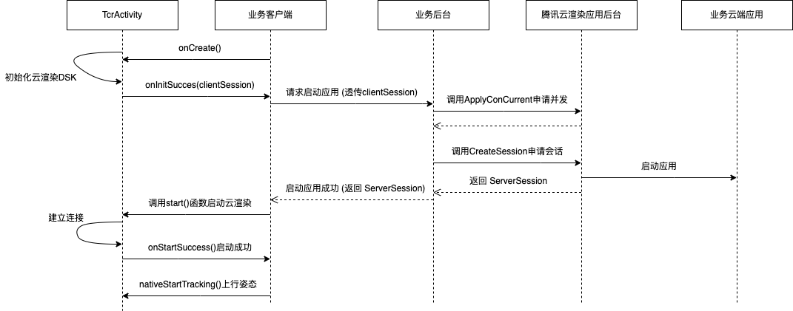

# SDK说明

## 一、SDK
相关SDK已发布到mavenCentral()，推荐通过Maven方式引用。

- Pico平台SDK：  implementation "com.tencent.tcr:vr-sdk-pico:x.x.x"
- Oculus平台SDK：implementation "com.tencent.tcr:vr-sdk-oculus:x.x.x"

最新版本请参考[发布记录](../发布记录.md)


## 二、前后端交互流程

腾讯云渲染VR SDK是基于云渲染SDK封装的一个组件，其内部直接调用了云渲染SDK接口。前后端交互流程和接入云渲染SDK的交互流程一致。
<br><br>

<br><br>

## 三、SDK接入流程

VR SDK暴露了一个TcrActivity供客户端应用程序接入.

### **步骤1：继承TcrActivity**

新建一个Activity并继承TcrActivity, 例如YourActivity。

### **步骤2：修改AndroidManifest.xml文件**

在AndroidManifest.xml文件中声明新建的Activity, 并包含以下内容:

```
    <activity
            android:name="YourActivity"
            android:configChanges="screenSize|screenLayout|orientation|keyboardHidden|keyboard|navigation|uiMode|density"
            android:excludeFromRecents="false"
            android:launchMode="singleTask"
            android:screenOrientation="landscape"
            tools:ignore="NonResizeableActivity"
            android:theme="@android:style/Theme.Black.NoTitleBar.Fullscreen"
            >
        <!-- Pico配置 -->
        <meta-data android:name="pvr.app.type" android:value="vr" />

        <!-- Oculus配置 -->
        <meta-data android:name="com.samsung.android.vr.application.mode" android:value="vr_only"/>

        <!-- 告诉YourActivity应该加载哪个.so文件 -->
        <meta-data
                android:name="android.app.lib_name"
                android:value="tcr_xr" />

        <intent-filter >
            <action android:name="android.intent.action.MAIN" />
            <category android:name="android.intent.category.LAUNCHER" />
        </intent-filter>

        <intent-filter>
            <category android:name="com.oculus.intent.category.VR" />
            <category android:name="org.khronos.openxr.intent.category.IMMERSIVE_HMD" />
        </intent-filter>
    </activity>
```

### **步骤3：处理并调用TcrActivity相关接口**

作为接入方，你需要关注以下几个函数
 - 初始化成功: `TcrActivity#onInitSuccess(String)`，当程序初始化成功时会回调该函数，你需要拿到回调的clientSession请求服务端获取ServerSession。
 - 初始化失败: `TcrActivity#onInitFailure(int, String)`，当程序初始化失败时回调该函数，通常你只能够退出，或提示用户当前出错让用户自行退出。
 - 启动会话: `TcrActivity#start(String)`，当你请求服务端拿到ServerSession时可以调用该函数启动会话建立连接。
 - 启动会话成功: `TcrActivity#onStartSuccess()`，告知你该会话启动成功，接下来等待视频流渲染。
 - 设置大厅文本: `TcrActivity#setLobbyText(String)`，在视频流渲染之前或渲染失败后你可以通过该函数设置在大厅显示的文本。