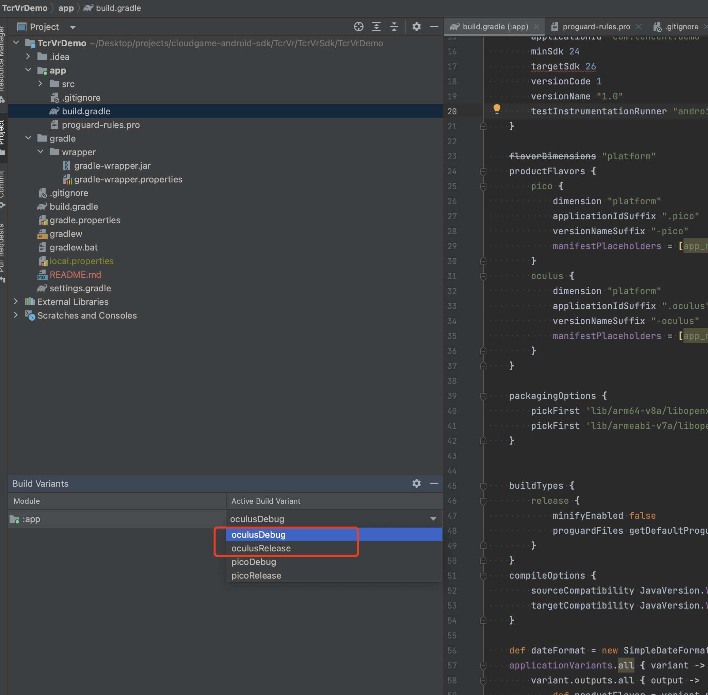

# 项目构建和运行指南

本文档将指导您如何构建和运行该项目，该项目使用Android Studio进行构建，并使用productFlavors来区分Oculus和Quest设备。

## 环境要求

在开始之前，请确保您的开发环境满足以下要求：

- Android Studio：确保您已经安装了最新版本的Android Studio。您可以从[官方网站](https://developer.android.com/studio)下载并安装它。

## 步骤

请按照以下步骤进行构建和运行您的项目：

1. 打开Android Studio：启动Android Studio，并选择“Open an existing Android Studio project”选项。导航到当前项目，并选择项目的根目录。

3. Gradle同步：一旦项目成功加载，Android Studio将自动执行Gradle同步。请确保Gradle同步成功，以便正确配置项目。

4. 构建变体：针对您需要构建的设备选择不同的变体，在Android Studio的右侧边栏中，找到“Build Variants”选项卡。点击它以展开构建变体面板，如果您当前需要在Oculus设备运行，请选择oculus
  

  

5. 选择设备：在构建变体面板中，您将看到一个下拉菜单，其中列出了可用的构建变体。选择您想要构建和运行的设备类型，例如Oculus或Quest。

6. 构建项目：点击Android Studio工具栏上的“Build”按钮，或者使用快捷键（通常是Ctrl/Cmd + F9）来构建您的项目。

7. 运行项目：一旦构建成功，您可以点击Android Studio工具栏上的“Run”按钮，或者使用快捷键（通常是Shift + F10）来运行您的项目。

8. 选择设备：如果您有多个设备连接到计算机，Android Studio将提示您选择要在哪个设备上运行应用程序。选择您想要运行应用程序的设备。

9. 应用程序安装和运行：Android Studio将自动将应用程序安装到您选择的设备上，并启动应用程序。您现在可以在设备上测试和使用您的应用程序了。

## 注意事项

- 确保您的设备已正确连接到计算机，并已启用开发者选项和USB调试模式。

- 如果您在构建或运行过程中遇到任何错误，请检查Android Studio的控制台输出和Gradle构建日志，以获取更多详细信息。

- 如果您需要进一步定制和配置您的构建过程，您可以修改项目的`build.gradle`文件和相关的Gradle脚本。

希望这份指南能对您有所帮助！如果您有任何进一步的问题，请随时提问。