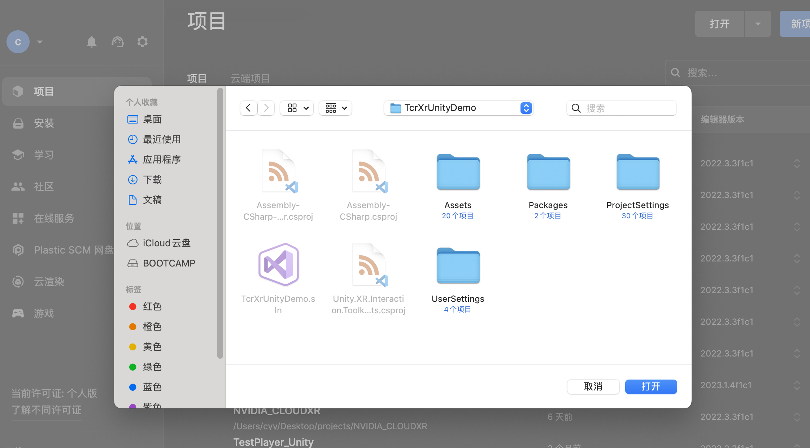
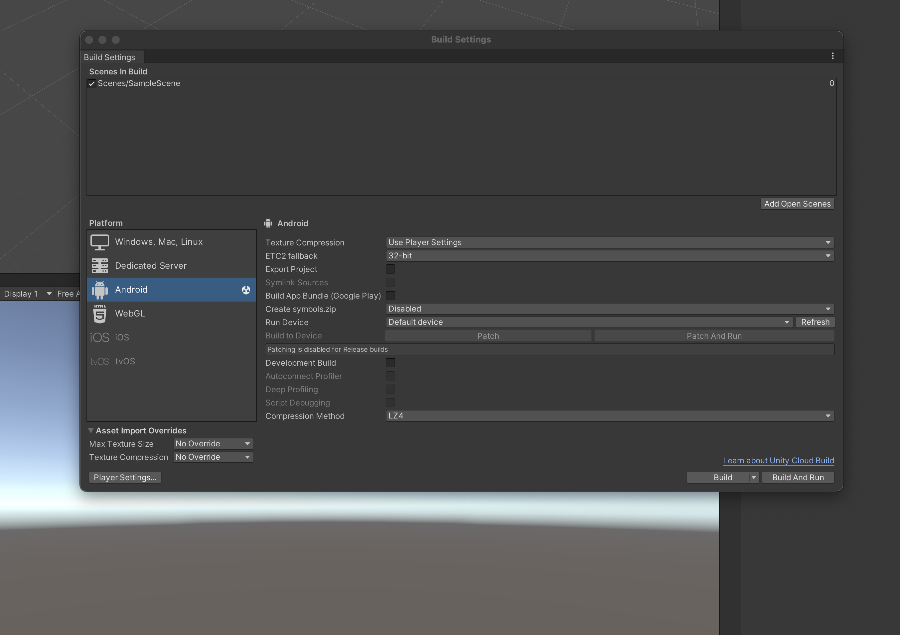
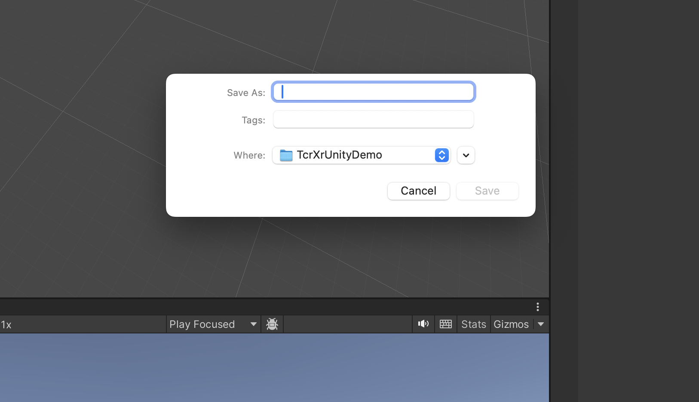
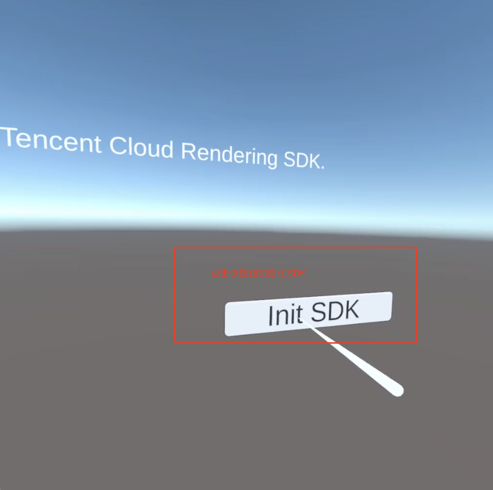

### 零、下载UnityDemo.zip
下载并解压UnityDemo.zip到任意目录，TcrXrUnityDemo文件夹就是我们的Demo工程。

### 一、运行环境
- Unity Hub 3.3.1-c9 (3.3.1-c9)
- Unity 2022.3.3f1c1
- 支持OpenXR的一体机设备(Meta Quest2)
### 二、Unity Hub配置
下载Unity Hub，并获取许可证。

1.打开Unity Hub，选择"安装"

2.选择Unity的版本2022.3.3f1c1。
> 若Unity Hub中已无法选择该版本，可以通过"安装Unity编辑器"中的"存档"入口跳转到官网地址进行下载。

3.安装Unity时请选择以下项目
- Android Build Support (包括所有的必选项)

4.选择"继续"完成安装。
### 三、导入工程
导入解压出来的TcrXrUnityDemo根目录

### 四、构建并运行
1.导入以后点击**File** > **Build Settings** (如果默认已经打开了Build Settings窗口，则不需要点击)

2.确认当前选中的是**Android**平台，若不是需选择**Android**平台，点击**Switch Platform**按钮。
3.通过数据线把一体机连接到运行应Unity工程的电脑上。
>插入数据线时一体机系统可能会提示需要获取通信必须的权限，需要点击允许。

4.点击**Build And Run**，会弹出对话框并提示输入产物名称，输入文件名后点击**Save**，开始构建。

等待构建完毕，会自动安装并在一体机中运行。

### 四、启动云渲染会话
在Unity场景中，通过右手手柄移动射线到**Init SDK**按钮上，扣动**Trigger**键或**A**键。

程序会请求云渲染体验平台，获取到ServerSession之后开始连接，并渲染画面。
