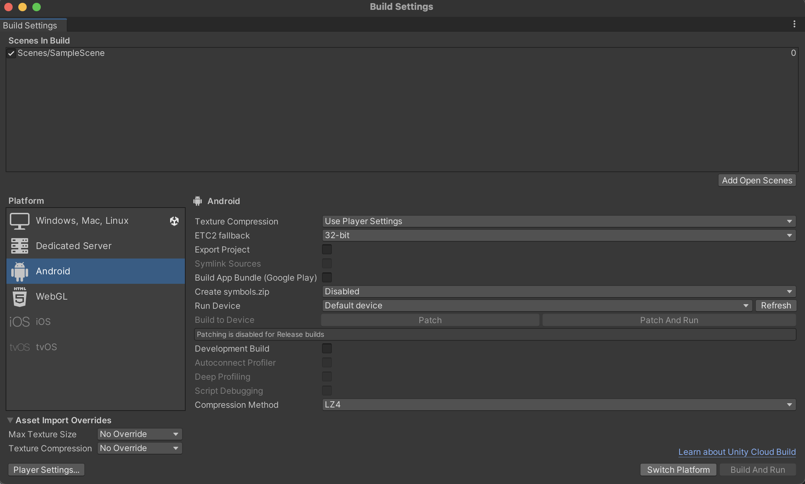
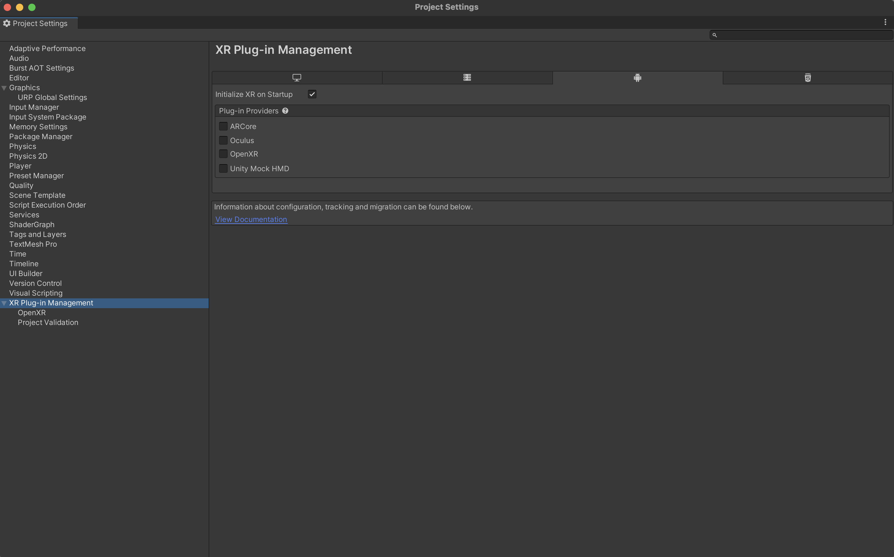

# 腾讯云渲染VR Unity接入指南
本指南介绍了如何在Unity工程中接入腾讯云渲染VR插件，接入方可以在Unity中开发自己的VR场景，之后通过用户在VR场景中的交互进入云渲染串流画面。
其中描述的步骤在Meta Quest2顺利跑通，对于其他厂家的设备和型号需要进一步测试验证。
## 一、运行环境
- 支持OpenXR的一体机设备(Meta Quest2/Quest3已验证)
- Unity版本2022.3.3f1c1(其他版本待验证)
## 二、Unity Hub配置
下载最新版本的Unity Hub，并获取许可证。

1.打开Unity Hub，选择"安装"

2.选择Unity的版本。

> 本指南验证的Unity版本是2022.3.3f1c1，建议读者先试用该版本进行测试。
> 若Unity Hub中已无法选择该版本，可以通过"安装Unity编辑器"中的"存档"入口跳转到官网地址进行下载。

3.安装Unity时请选择以下项目
- Android Build Support (包括所有的必选项)

4.选择"继续"完成安装。
## 三、创建Unity项目
在Unity Hub中选择”新项目"。
输入项目名称，并且选择"Universal 3D"这个模版。(如果没有这个模板，需要手动下载)

## 四、配置目标平台为Android环境
我们运行的目标平台是一体机，需要先把Unity构建的目标平台改为Android环境。

1.打开我们刚才创建好的Unity工程。

2.选择 **File** > **Build Settings**

3.选择**Android**平台，点击**Switch Platform**按钮。

## 五、项目设置
接下来的一系列步骤是针对XR项目进行的设置。
我们需要先安装**XR Plug-in Management**，之后通过它管理XR插件。

1.选择**Window** > **Package Manager**

2.在弹出的包管理窗口中，选择包来源为**Unity Registry**，这里会列出所有在官方注册的包。

滚动到最下方，选择**XR Plugin Management**，之后点击**Install**按钮，安装XR插件管理器。

3.在**XR Plugin Management**安装完以后, 点击**Edit** > **Project Settings**，可以看到最下方有一个**XR Plugin Management**的选项，点击该选项可以看到有针对不同平台的设置。

4.选择带有显示器图标的选项卡，然后选中**Open XR**这个选项，选中后会自动安装OpenXR插件。
> 请注意，这一步可能会弹出一个Warning，提示你项目使用新的输入系统，你需要点击Yes。

点击Yes之后，Unity会重启，完成后会回到项目设置窗口。
可以看到窗口中**XR Plugin Management**多了一个OpenXR子项。


5.继续选中**XR Plug-in Management**，点击Android图标对应的选项卡。
勾选该选项卡中的**OpenXR**，勾选之后会显示一个红色的感叹号，可以暂时忽略。

6.再次选择**Window** > **Package Manager**，回到包管理窗口，再次切换到 **Unity Registry** 包来源。

选择**XR Interaction Toolkit**，点击**Install**。
> 这里会提示XR InteractionLayerMask需要更新，点击**I Made a Backup, Go Ahead!*


7.再次点击**Edit** > **Project Settings**，打开项目设置窗口，选择**Player**。
在**Android平台**中，点击**Other Setting**。
- 确保**Rendering**里面的**Auto Graphics API**没有被选中。
- 删除**Graphics APIs**中的Vunkan
- 取消勾选**Multithreaded Rendering**

滚动到下方**Identification**的部分，设置**Minimum API Level**为**Android 10 API Level 29**。

 在**Configuration**部分中，将**Scripting Backend** 修改为 **IL2CPP**。
 对于大多数一体机目标架构为ARM64(我们在Meta Quest平台运行)，因此需要修改目标架构。
 在**Target Architectures**中取消勾选ARMv7，勾选ARM64。

8.在**Project Settings**中选择**Quality**。
删除**High Fidelity**和**Balanced**两个级别，仅保留**Performant**。

9.在**Project Settings**页面，选择**XR Plug-in Management**

(1) 确保Android选项卡中的OpenXR已经被选中。

(2) 展开左侧**XR Plug-in Management**的子项，选择**OpenXR**。
- 在**OpenXR Feature Groups**下面选择**Meta Quest Support**。(选择之后会显示一个红色感叹号，可先忽略)
- 在左侧**XR Plug-in Management**的子项中，选择**Project Validation**。找到OpenXR.Input.PoseControl将会被系统禁用的这条错误提示，点击**Fix**，之后等待Unity配置完成。

- 再次点击**Project Settings**页面左侧**XR Plug-in Management**的子项**OpenXR**，在**Interaction Profiles**中添加**Oculus Touch Controller Profile**

这一步操作完成后所有红色感叹号的错误提示都会消失。

10.配置XR手柄和XR相机。
> 这一步假设您使用的是XR Interaction Toolkit插件包，如果您使用的是其他包(例如XR Plugin Management或AR Foundation)你的摄像机设置可能会不一样。

(1) 为了方便我们配置和使用XR手柄，需要导入一些手柄输入动作的Preset。

回到**Package Manager**界面，选择**XR Interaction Toolkit**，之后点击**Samples**，导入**Starter Assets**。
这里会导入一些Preset，方便我们快速运行Demo。

导入之后可以在**Project**窗口里看到这些资源，在窗口中选中**XRI Default Right Controller**，然后点击**Add to Action BasedController default**。

再次打开**Project Settings**，选中**Preset Manager**，在**XRI Default Right Controller**对应的**Filter**中输入"Right"。
这样后续添加的右手柄，就会自动使用预设的右手柄动作。

(2) 回到Unity场景中，在Hierarchy里，删除场景中的**Main Camera**

(3) 在Hierarchy中点击右键，选择**XR** > **XR Origin (VR)**，添加一个XR的原点(原点会包含XR相机和手柄)。

(4) 选中**XR Origin**对象，在**Inspector**中将**Tracking Origin Mode**选项改为**Device**

## 六、构建项目
目前所有项目设置已经完成，我们需要先构建一次项目，看设置是否有问题。

1.通过数据线把一体机连接到运行应Unity工程的电脑上。插入数据线时一体机系统可能会提示需要获取通信必须的权限，需要点击允许。

2.在Unity编辑器中点击**File** > **Build Settings**

3.点击**Build And Run**，开始构建并运行程序。
运行之后戴上头盔，可以看到对应场景，右手手柄可以控制射线就是符合预期的。接下来我们开始接入云渲染VR插件。

## 七、导入腾讯云渲染VR插件到Unity工程
1.在导入Unity插件之前需要先把腾讯云渲染VR插件依赖的Android插件引入进来。

打开**Project Settings**窗口，在**Android**图标的Tab下面勾选**Custom Main Gradle Template**

之后打开**Project**视图中的**Assets/Plugins/Android/mainTemplate**文件

在文件中的**dependencies**块里添加如下声明
```
  implementation "com.tencent.tcr:tcr-vr-base:1.10.0"
```

2.[下载插件](https://cg-sdk-1258344699.cos-internal.ap-nanjing.tencentcos.cn/tcrvr-unity-plugins/tcr_cloudxr_unity_plugin_20240429_180511.zip)并解压到任意目录

3.通过**Window** > **Package Manger**，再次打开包管理界面。
点击左上角加号，选择**Add package from disk...**
4.在弹出来的对话框中，选择我们插件目录中的**package.json**文件

5.在插件加载完毕之后，点击**Samples**，再点击Import导入演示代码

导入之后可以在**Project**窗口中看到相应目录


## 八、在Unity工程中使用云渲染VR插件
1.点击场景中展开**XR Origin**对象，点击**Camera Offset** 下面的**Main Camera**。
在**Inspector**视图点击底部的**Add Component**，选择**Tencent** > **TcrXrManager**。

2.通过**Edit** > **Project Settings**，再次打开项目设置窗口。
选择**XR Plug-in Management** > **OpenXR**，再次选择**Android**图标选项卡。

3.点击**OpenXR Featrue Groups**中的**CloudXR Tuned Pose Capture**。

至此，云渲染VR插件配置完毕。

## 九、添加演示代码
以下这些步骤用于演示如何使用插件包中的示例代码和着色器。
这些脚本仅用于功能演示，接入者需要查看和理解他们，以便自行实现更好的体验效果。

1.再次点击场景中展开**XR Origin**对象，点击**Camera Offset** 下面的**Main Camera**。

2.展开 Assets > Samples > Tencetn CloudXR Client Unity Plugin > 0.0.1 > Rendering samples

3.把**TcrExample**脚本拖动到**Main Camera**对象的Inspector面板下面。


4.输入**体验码**(您可以在云渲染控制台自行生成体验码)

### 添加Shader到项目的渲染器中
完成上述步骤之后客户端可以连接到服务端，但无法渲染画面，接下来我们需要添加着色器代码。

1.再次打开**Project Settings**，点击**Graphics**，将**Scriptable Render Pipeline Settings**修改为**URP-Performant**

2.在**Project**视图中，点击**Settings** > **URP-Performant-Renderer**

3.在**Inspector**中点击**Add Renderer Feature** > **Tcr Renderer Feature**

4.将**Rendering samples**中的Reprojection拖动到 **Tcr Renderer Feature**中的Shader里。


## 十、可能会碰到的问题
### 构建失败: 提示android.useAndroidX属性没有开启

出现这个问题，可以在gradleTemplate.properties中启用AndroidX，步骤如下:

1.打开**Project Settings**窗口，在**Android**图标的Tab下面勾选**Custom Gradle Properties Template**

2.勾选之后，**Project**窗口中，**Assets/Plugins/Android**下面会自动创建一个**gradleTemplate**文件

3.打开**gradleTemplate**文件，增加一行配置
```
android.useAndroidX=true
```
保存后重新构建即可。