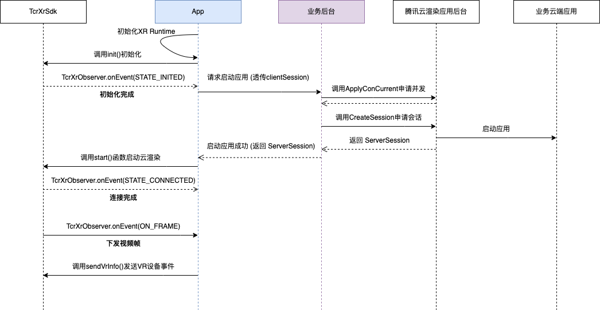

# SDK说明

## 一、SDK
相关SDK已发布到mavenCentral()，推荐通过Maven方式引用。

- implementation "com.tencent.tcr:tcr-vr-base:1.3.0"

最新版本请参考[发布记录](../发布记录.md)


## 二、前后端交互流程

腾讯云渲染VR SDK是基于云渲染SDK封装的一个组件，其内部直接调用了云渲染SDK接口。前后端交互流程和接入云渲染SDK的交互流程一致。
<br><br>

<br><br>

- 客户端需要先获取瞳距、FOV等信息, 之后构建```TcrXrSdk.Builder```作为参数调用```TcrXrSdk.init()```进行初始化
- 初始完成后客户端能够通过```TcrXrObserver.onEvent(STATE_INITED)```事件获得ClientSession
- 客户端通过ClientSession请求业务后台获取ServerSession后能够调用```TcrXrSdk.start()```发起连接
- 连接建立完成后客户端能够持续收到```TcrXrObserver.onEvent(ON_FRAME)```事件获得视频帧```VideoFrame```, 客户端获得视频帧之后能够拿到渲染所需的纹理、位姿等数据
- 客户端需要监听```TcrXrObserver.onEvent(REQUEST_VR_INFO)```事件, 在收到事件后查询XR事件并调用```TcrXrSdk.sendVrInfo()```将数据发送到云端


## 三、SDK API

###  [TcrXrConfig]()

[TcrXrSdk配置类-设置配置](https://tencentyun.github.io/cloudgame-android-sdk/tcrvr/1.5.0/com/tencent/tcr/xr/api/TcrXrConfig.html)

| API                                                          | 描述                  |
| ------------------------------------------------------------ | --------------------- |
| [builder](https://tencentyun.github.io/cloudgame-android-sdk/tcrvr/1.5.0/com/tencent/tcr/xr/api/TcrXrConfig.html#builder-com.tencent.tcr.xr.api.TcrXrObserver-java.lang.String-com.tencent.tcr.xr.api.bean.EyeInfo-) | 创建一个TcrXrConfig的构建器。 |

### TcrXrSdk

| API                                                          | 描述                  |
| ------------------------------------------------------------ | --------------------- |
| [getInstance](https://tencentyun.github.io/cloudgame-android-sdk/tcrvr/1.5.0/com/tencent/tcr/xr/api/TcrXrSdk.html#getInstance--) | 获取TcrXrSdk实例 |
| [init](https://tencentyun.github.io/cloudgame-android-sdk/tcrvr/1.5.0/com/tencent/tcr/xr/api/TcrXrSdk.html#init-Context-com.tencent.tcr.xr.api.TcrXrConfig-) | 初始化TcrXrSdk |
| [start](https://tencentyun.github.io/cloudgame-android-sdk/tcrvr/1.5.0/com/tencent/tcr/xr/api/TcrXrSdk.html#start-java.lang.String-) | 开始连接云端实例 |
| [stop](https://tencentyun.github.io/cloudgame-android-sdk/tcrvr/1.5.0/com/tencent/tcr/xr/api/TcrXrSdk.html#stop--) | 断开云端实例的连接并回收本地资源 |
| [sendVrInfo](https://tencentyun.github.io/cloudgame-android-sdk/tcrvr/1.5.0/com/tencent/tcr/xr/api/TcrXrSdk.html#sendVrInfo-com.tencent.tcr.xr.api.bean.VrInfo-) | 发送位姿、瞳距、手柄事件信息 |
| [pauseStreaming](https://tencentyun.github.io/cloudgame-android-sdk/tcrvr/1.5.0/com/tencent/tcr/xr/api/TcrXrSdk.html#pauseStreaming--) | 暂停服务端推流 |
| [resumeStreaming](https://tencentyun.github.io/cloudgame-android-sdk/tcrvr/1.5.0/com/tencent/tcr/xr/api/TcrXrSdk.html#resumeStreaming--) | 恢复服务端推流 |
| [getGLSharedContext]() | 返回一个共享的EGLContext，以便渲染线程能够使用```VideoFrame.getTextureId()```对应的纹理。 |

### TcrXrObserver
| API                                                          | 描述         |
| ------------------------------------------------------------ | ------------ |
| [onEvent](https://tencentyun.github.io/cloudgame-android-sdk/tcrvr/1.5.0/com/tencent/tcr/xr/api/TcrXrObserver.html#onEvent-com.tencent.tcr.xr.api.TcrXrObserver.Event-java.lang.Object-) | 事件通知 |

### TcrXrObserver.Event
| 定义                                                          | 描述         |
| ------------------------------------------------------------ | ------------ |
| [STATE_INIT_FAILURE](https://tencentyun.github.io/cloudgame-android-sdk/tcrvr/1.5.0/com/tencent/tcr/xr/api/TcrXrObserver.Event.html#STATE_INIT_FAILURE) | 这个事件表示内部会话初始化失败|
| [STATE_INITED](https://tencentyun.github.io/cloudgame-android-sdk/tcrvr/1.5.0/com/tencent/tcr/xr/api/TcrXrObserver.Event.html#STATE_INITED) | 这个事件表示内部会话已成功初始化|
| [STATE_CONNECTED](https://tencentyun.github.io/cloudgame-android-sdk/tcrvr/1.5.0/com/tencent/tcr/xr/api/TcrXrObserver.Event.html#STATE_CONNECTED) | 这个事件表示会话已连接成功|
| [STATE_RECONNECTING](https://tencentyun.github.io/cloudgame-android-sdk/tcrvr/1.5.0/com/tencent/tcr/xr/api/TcrXrObserver.Event.html#STATE_RECONNECTING) | 这个事件表示会话正在重连，客户端应该以某种方式告知用户当前正在重连|
| [STATE_CLOSED](https://tencentyun.github.io/cloudgame-android-sdk/tcrvr/1.5.0/com/tencent/tcr/xr/api/TcrXrObserver.Event.html#STATE_CLOSED) | 这个事件表示内部会话已经关闭, 无法再和云端进行交互|
| [REQUEST_VR_INFO](https://tencentyun.github.io/cloudgame-android-sdk/tcrvr/1.5.0/com/tencent/tcr/xr/api/TcrXrObserver.Event.html#REQUEST_VR_INFO) | 请求客户端更新头盔姿态、瞳距、手柄事件等信息|
| [ON_FRAME](https://tencentyun.github.io/cloudgame-android-sdk/tcrvr/1.5.0/com/tencent/tcr/xr/api/TcrXrObserver.Event.html#ON_FRAME) | 当接收到视频帧时触发该事件|

### VideoFrame

该类表示一个视频帧，对应云端下发的一帧画面(该画面的内容是左右眼投影后的画面)

| API                                                          | 描述                  |
| ------------------------------------------------------------ | --------------------- |
| [getLatency](https://tencentyun.github.io/cloudgame-android-sdk/tcrvr/1.5.0/com/tencent/tcr/xr/api/VideoFrame.html#getLatency--) | 返回从发送`Pose`到收到这一帧视频帧的延迟。 |
| [getRightFov](https://tencentyun.github.io/cloudgame-android-sdk/tcrvr/1.5.0/com/tencent/tcr/xr/api/VideoFrame.html#getRightFov--) | 返回生成这一帧画面右眼视场角 |
| [getLeftFov](https://tencentyun.github.io/cloudgame-android-sdk/tcrvr/1.5.0/com/tencent/tcr/xr/api/VideoFrame.html#getLeftFov--) | 返回生成这一帧画面的左眼视场角 |
| [getAssociateData](https://tencentyun.github.io/cloudgame-android-sdk/tcrvr/1.5.0/com/tencent/tcr/xr/api/VideoFrame.html#getAssociateData--) | 返回```VrInfo```构建时传入的业务自定义数据 |
| [getPose](https://tencentyun.github.io/cloudgame-android-sdk/tcrvr/1.5.0/com/tencent/tcr/xr/api/VideoFrame.html#getPose--) | 返回生成这一帧画面的位姿 |
| [getHeight](https://tencentyun.github.io/cloudgame-android-sdk/tcrvr/1.5.0/com/tencent/tcr/xr/api/VideoFrame.html#getHeight--) | 返回视频帧图像的高 |
| [getWidth](https://tencentyun.github.io/cloudgame-android-sdk/tcrvr/1.5.0/com/tencent/tcr/xr/api/VideoFrame.html#getWidth--) | 返回视频帧图像的宽 |
| [updateTexture](https://tencentyun.github.io/cloudgame-android-sdk/tcrvr/1.5.0/com/tencent/tcr/xr/api/VideoFrame.html#updateTexture--) | 更新视频帧纹理并返回该纹理ID |
| [release](https://tencentyun.github.io/cloudgame-android-sdk/tcrvr/1.5.0/com/tencent/tcr/xr/api/VideoFrame.html#release--) | 引用计数减1 |
| [retain](https://tencentyun.github.io/cloudgame-android-sdk/tcrvr/1.5.0/com/tencent/tcr/xr/api/VideoFrame.html#retain--) | 引用计数加1 |
